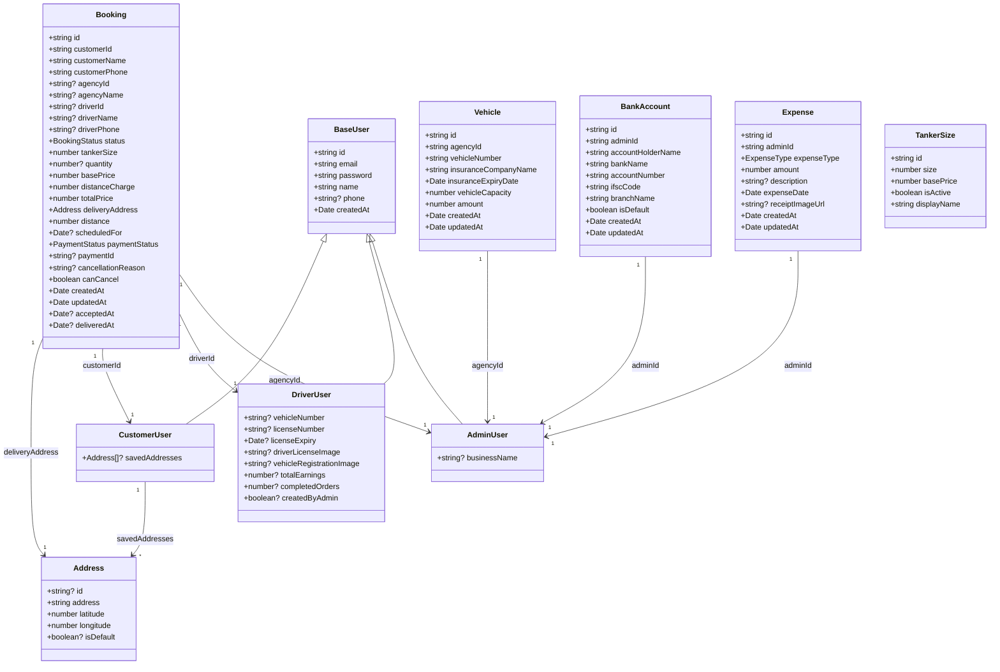
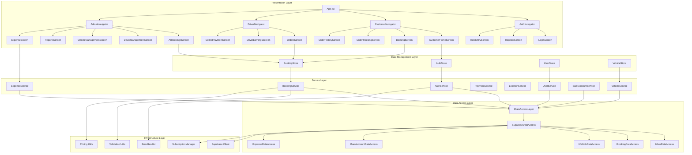
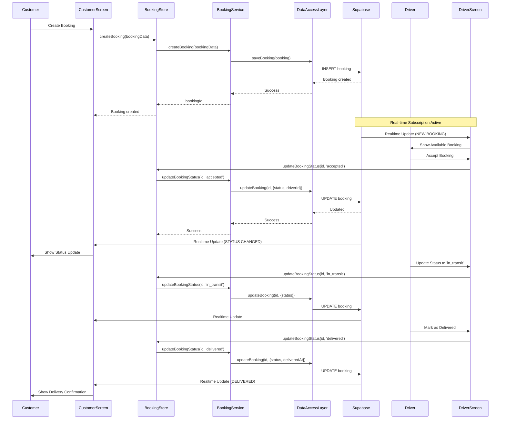
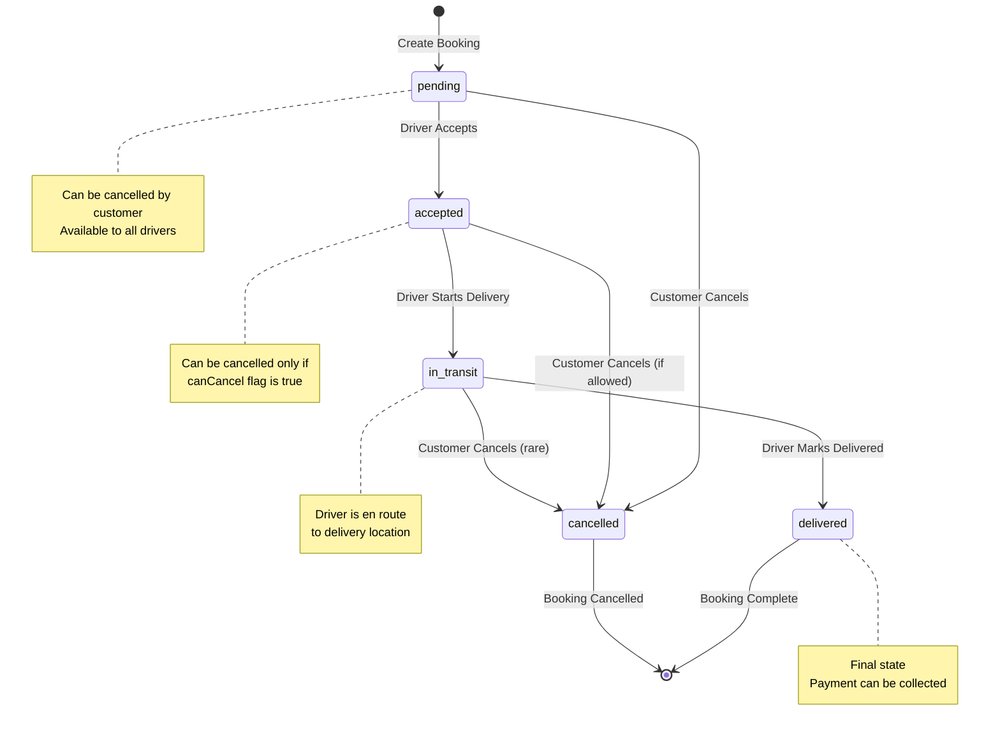
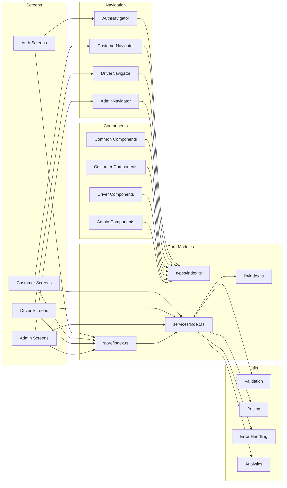

# Water Tanker Booking App

A comprehensive mobile application for on-demand water tanker delivery services. Built with React Native (Expo) and TypeScript, featuring a Supabase backend with real-time capabilities. The app supports multi-role authentication for customers, drivers, and administrators, each with role-specific features and interfaces.

## Table of Contents

- [Features](#features)
- [Tech Stack](#tech-stack)
- [Architecture](#architecture)
- [UML Diagrams](#uml-diagrams)
- [Prerequisites](#prerequisites)
- [Setup](#setup)
- [Project Structure](#project-structure)
- [Testing](#testing)
- [Supabase Configuration](#supabase-configuration)
- [Troubleshooting](#troubleshooting)
- [Roadmap](#roadmap)

## Features

### Customer Features
- **Booking Management**: Create, view, and track water tanker bookings
- **Address Management**: Save and manage multiple delivery addresses
- **Real-time Tracking**: Track booking status updates in real-time
- **Order History**: View past and current orders
- **Price Calculation**: Automatic distance-based pricing with Indian numbering format
- **Scheduled Deliveries**: Schedule deliveries for future dates

### Driver Features
- **Order Management**: Accept/reject available bookings
- **Status Updates**: Update booking status (in_transit, delivered)
- **Earnings Tracking**: View earnings, completed orders, and statistics
- **Payment Collection**: Collect and record payments from customers
- **Order Filtering**: Filter orders by status (pending, accepted, in_transit, delivered)

### Admin Features
- **Dashboard**: View comprehensive statistics and reports
- **Booking Management**: View and manage all bookings across the platform
- **Driver Management**: Add, edit, and manage driver accounts
- **Vehicle Management**: Manage vehicle fleet with insurance and capacity details
- **Bank Account Management**: Manage bank accounts for payments
- **Expense Management**: Track and manage business expenses (diesel and maintenance) with receipt image uploads
- **Reports & Analytics**: Generate reports on bookings, revenue, and driver performance

## Tech Stack

### Frontend
- **React Native** (Expo SDK ~54.0.27)
- **TypeScript** (~5.9.2)
- **React Navigation** v6 (Stack & Bottom Tabs)
- **Zustand** (State Management)
- **React Native Maps** (Location Services)
- **Expo Location** (GPS & Location Tracking)

### Backend
- **Supabase** (PostgreSQL Database)
- **Supabase Auth** (Authentication)
- **Supabase Realtime** (Real-time Subscriptions)

### Testing
- **Jest** (Unit Testing)
- **React Native Testing Library** (Component Testing)
- **Jest Expo** (Expo-specific Testing)

### Development Tools
- **Expo CLI** (Development & Build Tools)
- **TypeScript** (Type Safety)
- **ESLint** (Code Quality)

## Architecture

The application follows a **layered architecture** pattern with clear separation of concerns:

1. **Presentation Layer**: React Native screens and components
2. **State Management Layer**: Zustand stores for global state
3. **Service Layer**: Business logic and API interactions
4. **Data Access Layer**: Abstracted data persistence interface
5. **Infrastructure Layer**: Supabase client and utilities

### Key Design Patterns

- **Repository Pattern**: Data Access Layer abstracts database operations
- **Service Layer Pattern**: Business logic separated from UI and data access
- **Observer Pattern**: Real-time subscriptions for live updates
- **Factory Pattern**: Data access layer factory for different backends

## UML Diagrams

### 1. Class Diagram - Core Entities



### 2. Component Diagram - System Architecture



### 3. Sequence Diagram - Booking Flow



### 4. State Diagram - Booking Status Transitions



### 5. Package Diagram - Module Dependencies



## Prerequisites

Before you begin, ensure you have the following installed:

- **Node.js** 18+ and npm
- **Expo CLI** (`npm install -g expo-cli`)
- **Git** for version control
- **Supabase Account** with a project created
- **Google Maps API Key** (optional, for enhanced location features)

## Setup

### 1. Clone the Repository

```bash
git clone <repository-url>
cd WaterTankerAppv1
```

### 2. Install Dependencies

```bash
npm install
```

### 3. Environment Configuration

Create a `.env` file in the root directory:

```env
# Supabase Configuration
EXPO_PUBLIC_SUPABASE_URL=your_supabase_project_url
EXPO_PUBLIC_SUPABASE_ANON_KEY=your_supabase_anon_key

# Service Role Key (for scripts only - NEVER ship to client)
SUPABASE_SERVICE_ROLE_KEY=your_service_role_key

# Google Maps API Key (optional)
EXPO_PUBLIC_GOOGLE_MAPS_API_KEY=your_google_maps_api_key
```

### 4. Supabase Database Setup

Ensure your Supabase project has the following tables configured:

- `users` - Base user table
- `user_roles` - Multi-role support table
- `customers` - Customer-specific data
- `drivers` - Driver-specific data
- `admins` - Admin-specific data
- `bookings` - Booking/order table
- `vehicles` - Vehicle management table
- `bank_accounts` - Bank account information
- `tanker_sizes` - Tanker size configurations
- `pricing` - Pricing configuration

**Important**: Row Level Security (RLS) is enabled on all tables with comprehensive policies. Configure realtime publications for:
- `bookings`
- `notifications`
- `users`
- `user_roles`
- `customers`
- `drivers`
- `admins`
- `bank_accounts`
- `vehicles`
- `expenses`
- `tanker_sizes`
- `pricing`
- `driver_applications`
- `driver_locations`

### 5. Start the Development Server

```bash
npm start
```

Then choose your platform:
- Press `a` for Android
- Press `i` for iOS
- Press `w` for Web

## Project Structure

```
WaterTankerAppv1/
├── src/
│   ├── components/          # Reusable UI components
│   │   ├── admin/          # Admin-specific components
│   │   ├── customer/       # Customer-specific components
│   │   ├── driver/         # Driver-specific components
│   │   ├── auth/           # Authentication components
│   │   └── common/         # Shared components
│   │
│   ├── screens/            # Screen components
│   │   ├── admin/         # Admin screens
│   │   ├── customer/      # Customer screens
│   │   ├── driver/        # Driver screens
│   │   └── auth/           # Authentication screens
│   │
│   ├── navigation/        # Navigation configuration
│   │   ├── AuthNavigator.tsx
│   │   ├── CustomerNavigator.tsx
│   │   ├── DriverNavigator.tsx
│   │   └── AdminNavigator.tsx
│   │
│   ├── services/          # Business logic layer
│   │   ├── auth.service.ts
│   │   ├── booking.service.ts
│   │   ├── user.service.ts
│   │   ├── payment.service.ts
│   │   ├── location.service.ts
│   │   ├── vehicle.service.ts
│   │   ├── bankAccount.service.ts
│   │   └── expense.service.ts
│   │
│   ├── store/             # Zustand state management
│   │   ├── authStore.ts
│   │   ├── bookingStore.ts
│   │   ├── userStore.ts
│   │   └── vehicleStore.ts
│   │
│   ├── lib/               # Data access layer
│   │   ├── dataAccess.interface.ts
│   │   ├── supabaseDataAccess.ts
│   │   ├── supabaseClient.ts
│   │   └── subscriptionManager.ts
│   │
│   ├── utils/             # Utility functions
│   │   ├── validation.ts
│   │   ├── pricing.ts
│   │   ├── errorHandler.ts
│   │   ├── analytics.ts
│   │   └── ...
│   │
│   ├── types/             # TypeScript type definitions
│   │   └── index.ts
│   │
│   └── constants/         # App constants
│       └── config.ts
│
├── scripts/               # Utility scripts
│   ├── seed-test-data.ts
│   ├── performance-test.ts
│   └── ...
│
├── assets/               # Static assets
│   ├── fonts/
│   └── images/
│
├── App.tsx               # Root component
├── package.json
├── tsconfig.json
└── README.md
```

## Testing

### Run Tests

```bash
# Run all tests
npm test

# Run tests in watch mode
npm run test:watch

# Generate coverage report
npm run test:coverage
```

### Test Structure

- **Unit Tests**: Test individual functions and utilities
- **Integration Tests**: Test service layer and data access layer
- **Component Tests**: Test React Native components
- **Flow Tests**: Test complete user flows (booking, payment, etc.)

### Test Coverage

The project maintains comprehensive test coverage for:
- Services (auth, booking, payment, etc.)
- Utilities (validation, pricing, error handling)
- Stores (state management)
- Components (UI components)
- Integration flows

## Supabase Configuration

### Required Tables

1. **users**: Base user information
2. **user_roles**: Multi-role support (customer, driver, admin)
3. **customers**: Customer-specific data
4. **drivers**: Driver-specific data
5. **admins**: Admin-specific data
6. **bookings**: Booking/order information
7. **vehicles**: Vehicle fleet management
8. **bank_accounts**: Bank account details
9. **tanker_sizes**: Available tanker sizes
10. **pricing**: Distance-based pricing configuration

### Row Level Security (RLS)

RLS is **enabled on all tables** with comprehensive role-based access control policies:

#### Tables with RLS Enabled
- `users` - User profile access control
- `user_roles` - Role management access
- `customers` - Customer data access
- `drivers` - Driver data access
- `admins` - Admin data access
- `bookings` - Booking access by role
- `vehicles` - Vehicle management by agency
- `bank_accounts` - Bank account access by admin and drivers (for payment collection)
- `expenses` - Admin can manage their own expenses (full CRUD)
- `tanker_sizes` - Public read, admin write
- `pricing` - Public read, admin write
- `driver_applications` - Public create, admin manage
- `driver_locations` - Driver and customer access

#### Policy Overview

**Users Table:**
- Users can view, insert, and update their own profile
- Admins can view all users
- Customers can read admin users (for agency selection during booking)

**User Roles Table:**
- Users can view and insert their own roles
- Admins can view all user roles
- Customers can read admin roles (to identify agencies)

**Customers Table:**
- Customers can view, insert, and update their own data
- Admins can view all customer data

**Drivers Table:**
- Drivers can view, insert, and update their own data
- Admins can view and update all driver data

**Admins Table:**
- Admins can view, insert, and update their own data
- Admins can view other admin data
- Customers can read admin data (for agency selection during booking)

**Bookings Table:**
- Customers can create, view, and update their own bookings
- Drivers can view available bookings and update assigned bookings
- Admins can view and update bookings for their agency

**Vehicles Table:**
- Admins can manage vehicles for their agency (full CRUD)
- Customers can read vehicles from any agency (for booking creation)

**Bank Accounts Table:**
- Admins can manage their own bank accounts (full CRUD)
- Drivers can read bank accounts for agencies where they have assigned bookings (for QR code display during payment collection)

**Expenses Table:**
- Admins can create, view, update, and delete their own expenses
- Supports filtering by expense type (diesel or maintenance)
- Includes receipt image upload functionality

**Tanker Sizes Table:**
- Everyone can view active tanker sizes
- Admins can view all sizes and manage them (full CRUD)

**Pricing Table:**
- Everyone can view pricing
- Admins can insert and update pricing

**Driver Applications Table:**
- Anyone can create driver applications
- Admins can view and update all applications

**Driver Locations Table:**
- Drivers can insert and view their own locations
- Admins can view all driver locations
- Customers can view driver locations for their active bookings

All policies use a secure `has_role()` helper function that checks user roles from the `user_roles` table.

### Realtime Subscriptions

Enable realtime for:
- `bookings` table (for status updates)
- `notifications` table (for push notifications)
- `users` table (for profile updates)

## Troubleshooting

### Authentication Issues

**Problem**: Login fails or user not found

**Solutions**:
- Verify `EXPO_PUBLIC_SUPABASE_URL` and `EXPO_PUBLIC_SUPABASE_ANON_KEY` in `.env`
- Ensure Email provider is enabled in Supabase Auth settings
- Check that user exists in `users` table with corresponding `user_roles` entry
- Verify RLS policies allow user access

### Realtime Not Working

**Problem**: Real-time updates not appearing

**Solutions**:
- Confirm realtime is enabled for relevant tables in Supabase
- Check that tables are added to realtime publication
- Verify subscription is active (check network tab)
- Ensure client is online and connected

### RLS Policy Errors

**Problem**: "Row Level Security policy violation" errors

**Solutions**:
- Ensure `user_roles` table has entry for the user's selected role
- Verify RLS policies match the user's role
- Check that policies allow the required operations (SELECT, INSERT, UPDATE, DELETE)
- Review Supabase logs for specific policy violations

### Build Issues

**Problem**: Build fails or app crashes on startup

**Solutions**:
- Clear Expo cache: `expo start -c`
- Delete `node_modules` and reinstall: `rm -rf node_modules && npm install`
- Check for TypeScript errors: `npx tsc --noEmit`
- Verify all environment variables are set correctly

## Roadmap

### Version 2.0 (Planned Features)

- [ ] **Online Payment Integration**
  - Payment gateway integration (Razorpay/Stripe)
  - Payment history and receipts
  - Refund management

- [ ] **Push Notifications**
  - Real-time order updates
  - Driver assignment notifications
  - Payment reminders

- [ ] **Real-time GPS Tracking**
  - Live driver location tracking
  - Route optimization
  - ETA calculations

- [ ] **Google Distance Matrix Integration**
  - Accurate distance calculations
  - Traffic-aware routing
  - Multiple route options

- [ ] **Driver Self-Registration**
  - Driver application workflow
  - Document upload and verification
  - Approval/rejection system

- [ ] **Ratings & Reviews**
  - Customer ratings for drivers
  - Driver ratings for customers
  - Review system

- [ ] **ASAP Bookings**
  - Immediate booking option
  - Priority queue for urgent orders
  - Fast-track driver assignment

- [ ] **Performance Optimizations**
  - Query optimization
  - Caching strategies
  - Image optimization
  - Bundle size reduction

- [ ] **Advanced Analytics**
  - Revenue forecasting
  - Driver performance metrics
  - Customer behavior analysis
  - Demand prediction

## Contributing

1. Fork the repository
2. Create a feature branch (`git checkout -b feature/amazing-feature`)
3. Commit your changes (`git commit -m 'Add some amazing feature'`)
4. Push to the branch (`git push origin feature/amazing-feature`)
5. Open a Pull Request

## License

This project is private and proprietary.

## Support

For issues, questions, or contributions, please contact the development team or open an issue in the repository.

---

**Built with ❤️ using React Native, Expo, and Supabase**

