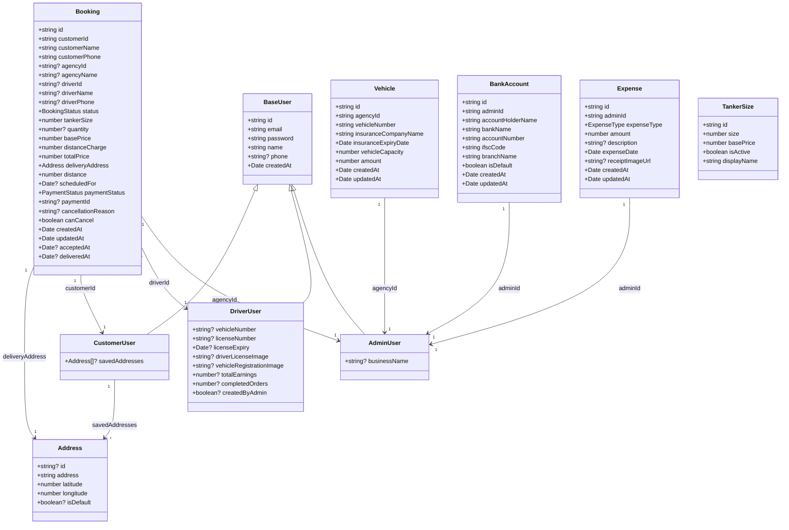
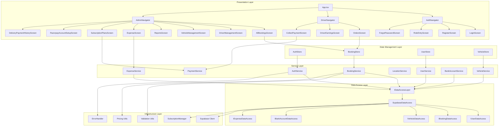
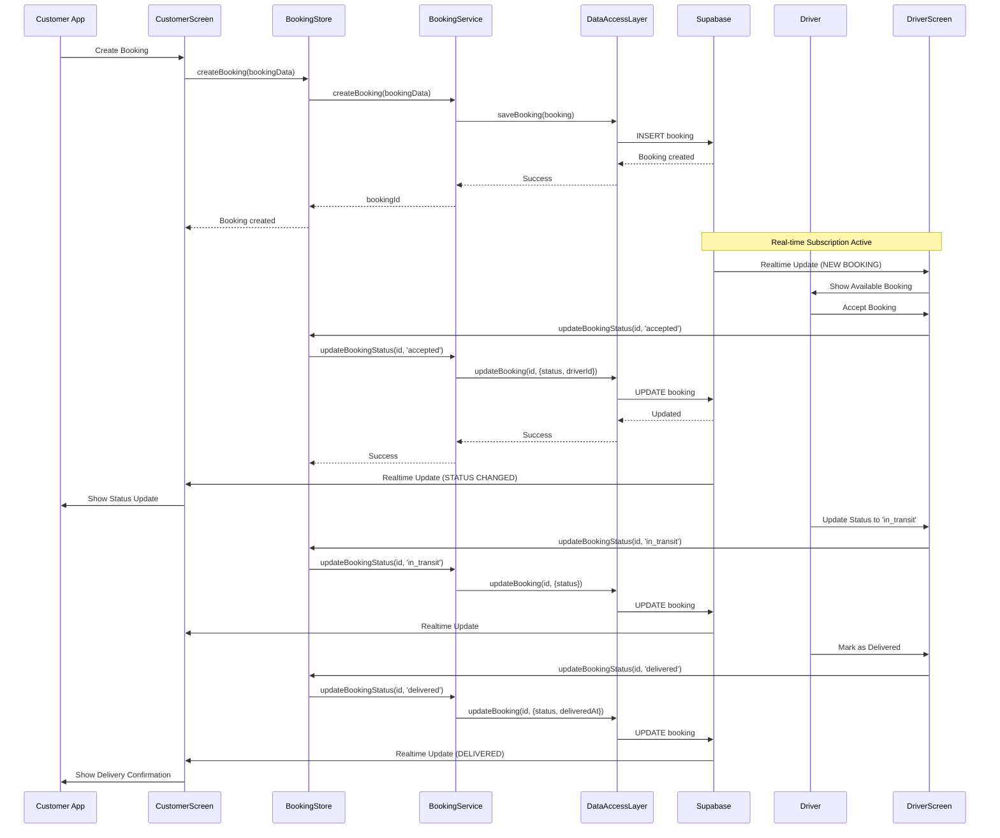
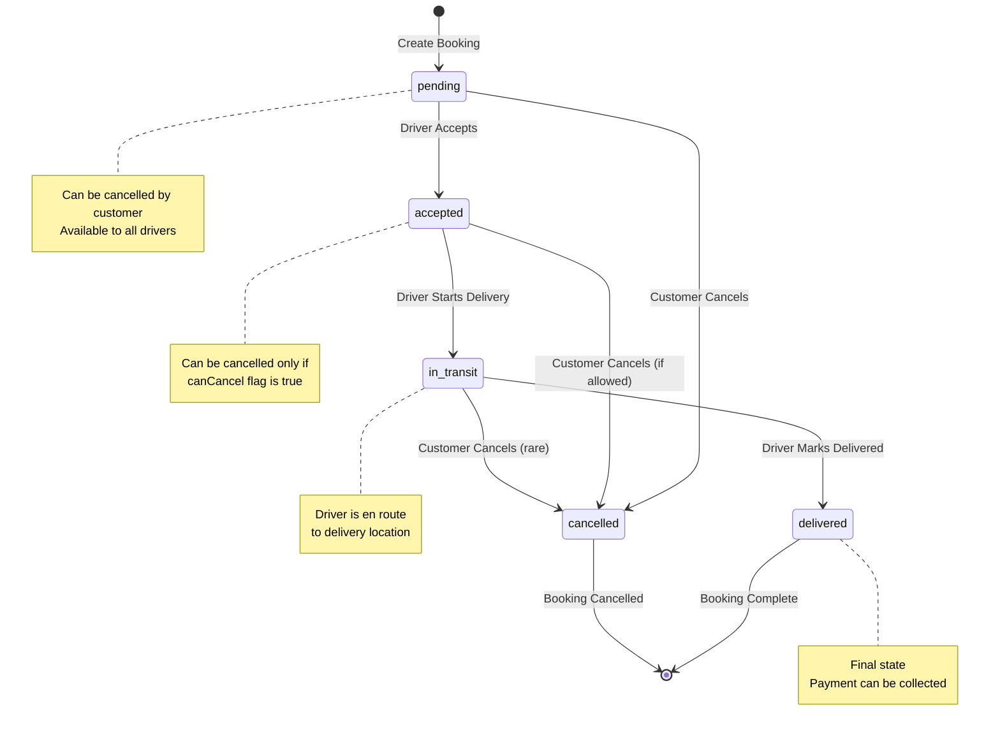
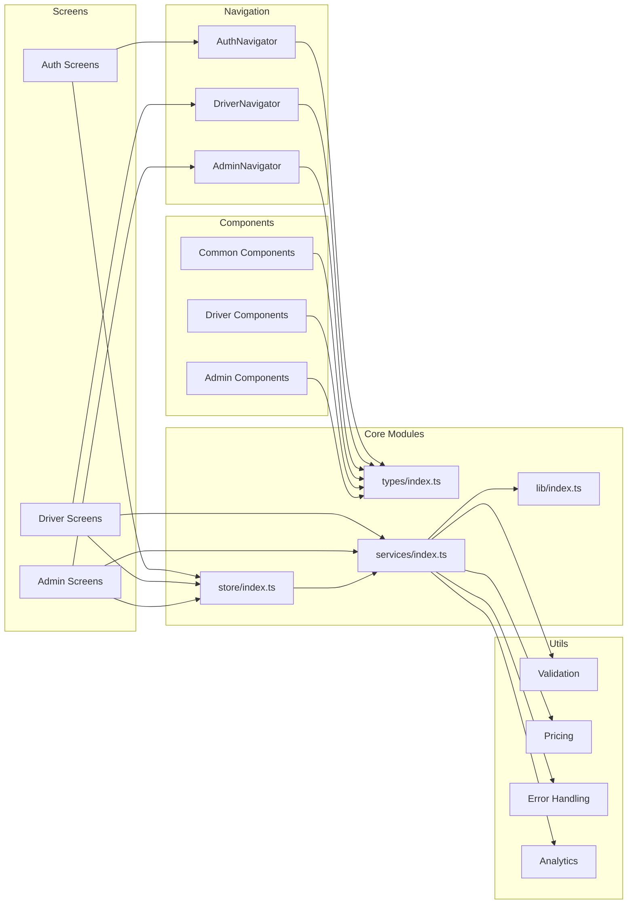

# Water Tanker Admin + Driver App

A React Native (Expo) mobile application for water tanker **agency admins** and **drivers**. Built with TypeScript and Supabase (PostgreSQL, Auth, Realtime, Edge Functions), with **Razorpay** for platform subscriptions and delivery payments. Customer booking is handled by a separate customer mobile app that shares the same backend.

## Table of Contents

- [Features](#features)
- [Tech Stack](#tech-stack)
- [Architecture](#architecture)
- [UML Diagrams](#uml-diagrams)
- [Prerequisites](#prerequisites)
- [Setup](#setup)
- [Project Structure](#project-structure)
- [Testing](#testing)
- [Supabase Configuration](#supabase-configuration)
- [Payments & Subscriptions (Razorpay)](#payments--subscriptions-razorpay)
- [Edge Functions](#edge-functions)
- [Documentation](#documentation)
- [Troubleshooting](#troubleshooting)
- [Roadmap](#roadmap)

## Features

### Driver Features
- **Order Management**: Accept/reject available bookings scoped to the driver’s agency
- **Status Updates**: Update booking status (in_transit, delivered)
- **Earnings Tracking**: View earnings, completed orders, and statistics
- **Payment Collection**: Collect delivery payments via Razorpay Checkout or manual QR/cash (agency-configurable)
- **Order Filtering**: Filter orders by status (pending, accepted, in_transit, delivered)

### Admin Features
- **Dashboard & Reports**: View statistics, society trip breakdowns, and revenue reports
- **Booking Management**: View and manage all bookings for the agency
- **Driver Management**: Add, edit, reset passwords, and remove driver accounts (via Edge Functions)
- **Vehicle Management**: Manage vehicle fleet with insurance and capacity details
- **Bank Account Management**: Manage bank accounts for manual QR collection
- **Platform Subscription**: Subscribe to agency plans (monthly/quarterly/half-yearly/yearly) via Razorpay
- **Razorpay Route & Payouts**: Onboard linked accounts, track KYC status, and view delivery payment history
- **Expense Management**: Track diesel and maintenance expenses with receipt image uploads

## Tech Stack

### Frontend
- **React Native** (Expo SDK ~54.0.27)
- **TypeScript** (~5.9.2)
- **React Navigation** v6 (Stack & Bottom Tabs)
- **Zustand** (State Management)
- **React Native Maps** (Location Services)
- **Expo Location** (GPS & Location Tracking)
- **react-native-razorpay** (In-app Checkout)

### Backend
- **Supabase** (PostgreSQL Database)
- **Supabase Auth** (Authentication)
- **Supabase Realtime** (Real-time Subscriptions)
- **Supabase Edge Functions** (Razorpay orders, webhooks, admin auth helpers, Resend email hook)
- **Razorpay** (Platform subscriptions + Route linked accounts for delivery payments)
- **Resend** (Auth emails via Send Email hook)

### Testing
- **Jest** (Unit Testing)
- **React Native Testing Library** (Component Testing)
- **Jest Expo** (Expo-specific Testing)

### Development Tools
- **Expo CLI** (Development & Build Tools)
- **TypeScript** (Type Safety)
- **ESLint** (Code Quality)

## Architecture

The application follows a **layered architecture** pattern with clear separation of concerns:

1. **Presentation Layer**: React Native screens and components
2. **State Management Layer**: Zustand stores for global state
3. **Service Layer**: Business logic and API interactions
4. **Data Access Layer**: Abstracted data persistence interface
5. **Infrastructure Layer**: Supabase client and utilities

### Key Design Patterns

- **Repository Pattern**: Data Access Layer abstracts database operations
- **Service Layer Pattern**: Business logic separated from UI and data access
- **Observer Pattern**: Real-time subscriptions for live updates
- **Factory Pattern**: Data access layer factory for different backends

## UML Diagrams

### 1. Class Diagram - Core Entities


```mermaid
classDiagram
    class BaseUser {
        +string id
        +string email
        +string password
        +string name
        +string? phone
        +Date createdAt
    }
    
    class CustomerUser {
        +Address[]? savedAddresses
    }
    
    class DriverUser {
        +string? vehicleNumber
        +string? licenseNumber
        +Date? licenseExpiry
        +string? driverLicenseImage
        +string? vehicleRegistrationImage
        +number? totalEarnings
        +number? completedOrders
        +boolean? createdByAdmin
    }
    
    class AdminUser {
        +string? businessName
    }
    
    class Booking {
        +string id
        +string customerId
        +string customerName
        +string customerPhone
        +string? agencyId
        +string? agencyName
        +string? driverId
        +string? driverName
        +string? driverPhone
        +BookingStatus status
        +number tankerSize
        +number? quantity
        +number basePrice
        +number distanceCharge
        +number totalPrice
        +Address deliveryAddress
        +number distance
        +Date? scheduledFor
        +PaymentStatus paymentStatus
        +string? paymentId
        +string? cancellationReason
        +boolean canCancel
        +Date createdAt
        +Date updatedAt
        +Date? acceptedAt
        +Date? deliveredAt
    }
    
    class Address {
        +string? id
        +string address
        +number latitude
        +number longitude
        +boolean? isDefault
    }
    
    class Vehicle {
        +string id
        +string agencyId
        +string vehicleNumber
        +string insuranceCompanyName
        +Date insuranceExpiryDate
        +number vehicleCapacity
        +number amount
        +Date createdAt
        +Date updatedAt
    }
    
    class BankAccount {
        +string id
        +string adminId
        +string accountHolderName
        +string bankName
        +string accountNumber
        +string ifscCode
        +string branchName
        +boolean isDefault
        +Date createdAt
        +Date updatedAt
    }
    
    class Expense {
        +string id
        +string adminId
        +ExpenseType expenseType
        +number amount
        +string? description
        +Date expenseDate
        +string? receiptImageUrl
        +Date createdAt
        +Date updatedAt
    }
    
    class TankerSize {
        +string id
        +number size
        +number basePrice
        +boolean isActive
        +string displayName
    }
    
    BaseUser <|-- CustomerUser
    BaseUser <|-- DriverUser
    BaseUser <|-- AdminUser
    Booking "1" --> "1" Address : deliveryAddress
    Booking "1" --> "1" CustomerUser : customerId
    Booking "0..1" --> "1" DriverUser : driverId
    Booking "0..1" --> "1" AdminUser : agencyId
    Vehicle "1" --> "1" AdminUser : agencyId
    BankAccount "1" --> "1" AdminUser : adminId
    Expense "1" --> "1" AdminUser : adminId
    CustomerUser "1" --> "*" Address : savedAddresses
```

### 2. Component Diagram - System Architecture

This app exposes **Auth**, **Driver**, and **Admin** navigators only. Customer booking UI lives in a separate mobile app that shares the same Supabase project.


```mermaid
graph TB
    subgraph "Presentation Layer"
        A[App.tsx] --> B[AuthNavigator]
        A --> D[DriverNavigator]
        A --> E[AdminNavigator]
        
        B --> F[LoginScreen]
        B --> G[RegisterScreen]
        B --> H[RoleEntryScreen]
        B --> H2[ForgotPasswordScreen]
        
        D --> M[OrdersScreen]
        D --> N[DriverEarningsScreen]
        D --> O[CollectPaymentScreen]
        
        E --> P[AllBookingsScreen]
        E --> Q[DriverManagementScreen]
        E --> R[VehicleManagementScreen]
        E --> S[ReportsScreen]
        E --> TA[ExpenseScreen]
        E --> TB[SubscriptionPlansScreen]
        E --> TC[RazorpayAccountSetupScreen]
        E --> TD[DeliveryPaymentHistoryScreen]
    end
    
    subgraph "State Management Layer"
        T[AuthStore]
        U[BookingStore]
        V[UserStore]
        W[VehicleStore]
    end
    
    subgraph "Service Layer"
        X[AuthService]
        Y[BookingService]
        Z[UserService]
        AA[PaymentService]
        AB[LocationService]
        AC[VehicleService]
        AD[BankAccountService]
        AE[ExpenseService]
    end
    
    subgraph "Data Access Layer"
        AF[IDataAccessLayer]
        AG[SupabaseDataAccess]
        AH[IUserDataAccess]
        AI[IBookingDataAccess]
        AJ[IVehicleDataAccess]
        AK[IBankAccountDataAccess]
        AL[IExpenseDataAccess]
    end
    
    subgraph "Infrastructure Layer"
        AM[Supabase Client]
        AN[SubscriptionManager]
        AO[ErrorHandler]
        AP[Validation Utils]
        AQ[Pricing Utils]
    end
    
    M --> U
    P --> U
    TA --> AE
    TB --> AA
    O --> AA
    
    T --> X
    U --> Y
    V --> Z
    W --> AC
    
    X --> AF
    Y --> AF
    Z --> AF
    AC --> AF
    AD --> AF
    AE --> AF
    
    AF --> AG
    AG --> AH
    AG --> AI
    AG --> AJ
    AG --> AK
    AG --> AL
    
    AG --> AM
    AG --> AN
    X --> AO
    Y --> AP
    Y --> AQ
```

### 3. Sequence Diagram - Booking Flow

End-to-end platform flow (customer actions occur in the separate customer app; driver/admin actions in this app).


```mermaid
sequenceDiagram
    participant C as Customer App
    participant CS as CustomerScreen
    participant BS as BookingStore
    participant BKS as BookingService
    participant DAL as DataAccessLayer
    participant DB as Supabase
    participant D as Driver
    participant DS as DriverScreen
    
    C->>CS: Create Booking
    CS->>BS: createBooking(bookingData)
    BS->>BKS: createBooking(bookingData)
    BKS->>DAL: saveBooking(booking)
    DAL->>DB: INSERT booking
    DB-->>DAL: Booking created
    DAL-->>BKS: Success
    BKS-->>BS: bookingId
    BS-->>CS: Booking created
    
    Note over DB,DS: Real-time Subscription Active
    
    DB->>DS: Realtime Update (NEW BOOKING)
    DS->>D: Show Available Booking
    D->>DS: Accept Booking
    DS->>BS: updateBookingStatus(id, 'accepted')
    BS->>BKS: updateBookingStatus(id, 'accepted')
    BKS->>DAL: updateBooking(id, {status, driverId})
    DAL->>DB: UPDATE booking
    DB-->>DAL: Updated
    DAL-->>BKS: Success
    BKS-->>BS: Success
    
    DB->>CS: Realtime Update (STATUS CHANGED)
    CS->>C: Show Status Update
    
    D->>DS: Update Status to 'in_transit'
    DS->>BS: updateBookingStatus(id, 'in_transit')
    BS->>BKS: updateBookingStatus(id, 'in_transit')
    BKS->>DAL: updateBooking(id, {status})
    DAL->>DB: UPDATE booking
    DB->>CS: Realtime Update
    
    D->>DS: Mark as Delivered
    DS->>BS: updateBookingStatus(id, 'delivered')
    BS->>BKS: updateBookingStatus(id, 'delivered')
    BKS->>DAL: updateBooking(id, {status, deliveredAt})
    DAL->>DB: UPDATE booking
    DB->>CS: Realtime Update (DELIVERED)
    CS->>C: Show Delivery Confirmation
```

### 4. State Diagram - Booking Status Transitions


```mermaid
stateDiagram-v2
    [*] --> pending: Create Booking
    
    pending --> accepted: Driver Accepts
    pending --> cancelled: Customer Cancels
    
    accepted --> in_transit: Driver Starts Delivery
    accepted --> cancelled: Customer Cancels (if allowed)
    
    in_transit --> delivered: Driver Marks Delivered
    in_transit --> cancelled: Customer Cancels (rare)
    
    delivered --> [*]: Booking Complete
    cancelled --> [*]: Booking Cancelled
    
    note right of pending
        Can be cancelled by customer
        Available to all drivers
    end note
    
    note right of accepted
        Can be cancelled only if
        canCancel flag is true
    end note
    
    note right of in_transit
        Driver is en route
        to delivery location
    end note
    
    note right of delivered
        Final state
        Payment can be collected
    end note
```

### 5. Package Diagram - Module Dependencies


```mermaid
graph LR
    subgraph "Core Modules"
        A[types/index.ts]
        B[lib/index.ts]
        C[store/index.ts]
        D[services/index.ts]
    end
    
    subgraph "Navigation"
        E[AuthNavigator]
        G[DriverNavigator]
        H[AdminNavigator]
    end
    
    subgraph "Screens"
        I[Auth Screens]
        K[Driver Screens]
        L[Admin Screens]
    end
    
    subgraph "Components"
        M[Common Components]
        O[Driver Components]
        P[Admin Components]
    end
    
    subgraph "Utils"
        Q[Validation]
        R[Pricing]
        S[Error Handling]
        T[Analytics]
    end
    
    I --> E
    K --> G
    L --> H
    
    E --> A
    G --> A
    H --> A
    
    I --> C
    K --> C
    L --> C
    
    K --> D
    L --> D
    
    M --> A
    O --> A
    P --> A
    
    D --> B
    C --> D
    D --> Q
    D --> R
    D --> S
    D --> T
```

## Prerequisites

Before you begin, ensure you have the following installed or configured:

- **Node.js** 18+ and npm
- **Expo CLI** / **EAS CLI** (for dev client and production builds)
- **Git** for version control
- **Supabase Account** with a project created (shared with the customer app)
- **Supabase CLI** (`npx supabase`) for migrations and Edge Function deploys
- **Razorpay Account** (test keys for development; Route enabled for delivery payouts)
- **Resend Account** (for auth emails via the Send Email hook)
- **Google Maps API Key** (optional, for enhanced location features)

## Setup

### 1. Clone the Repository

```bash
git clone <repository-url>
cd WaterTankerAppv1
```

### 2. Install Dependencies

```bash
npm install
```

### 3. Environment Configuration

Copy `.env.example` to `.env` in the project root and fill in values:

```env
# Supabase (Dashboard → Settings → API)
EXPO_PUBLIC_SUPABASE_URL=https://your-project-id.supabase.co
EXPO_PUBLIC_SUPABASE_ANON_KEY=your-anon-key-here

# Razorpay publishable Key ID only — never put Key Secret in the app
EXPO_PUBLIC_RAZORPAY_KEY_ID=rzp_test_your_key_id_here

# Optional: auth email link landing page (add to Supabase Redirect URLs)
EXPO_PUBLIC_AUTH_REDIRECT_URL=https://yourdomain.com/auth/confirmed

# Password reset redirect (admin forgot-password flow)
EXPO_PUBLIC_PASSWORD_RESET_REDIRECT_URL=https://tankerhub.in/auth/reset-password

# Server-side only (migration/scripts — never ship to client)
SUPABASE_SERVICE_ROLE_KEY=your-service-role-key-here
```

Edge Function secrets (Razorpay Key Secret, webhook secret, Resend) belong in `supabase/functions/.env` — see [Edge Functions](#edge-functions).

### 4. Supabase Database Setup

Apply migrations from `supabase/migrations/` (includes Razorpay foundation and agency trial/RLS fixes):

```bash
npx supabase link --project-ref <your-project-ref>
npx supabase db push
```

Ensure your Supabase project has the core tables configured:

- `users`, `user_roles`, `customers`, `drivers`, `admins`
- `bookings`, `vehicles`, `bank_accounts`, `tanker_sizes`, `pricing`, `expenses`
- `subscription_plans`, `subscriptions`, `payment_transactions` (payments)
- `agency_razorpay_accounts` (Razorpay Route onboarding per agency)

**Important**: Row Level Security (RLS) is enabled on all tables with comprehensive policies. Configure realtime publications for:
- `bookings`
- `notifications`
- `users`
- `user_roles`
- `customers`
- `drivers`
- `admins`
- `bank_accounts`
- `vehicles`
- `expenses`
- `tanker_sizes`
- `pricing`
- `driver_applications`
- `driver_locations`

### 5. Supabase Edge Functions

Deploy server-side functions (Razorpay, auth email hook, admin helpers). Full details: [supabase/functions/README.md](supabase/functions/README.md).

```bash
# Copy and fill Edge Function secrets
cp supabase/functions/.env.example supabase/functions/.env
npx supabase secrets set --env-file supabase/functions/.env

# Deploy all configured functions
npx supabase functions deploy
```

Configure the **Send Email** auth hook and **Razorpay webhook** in their respective dashboards after deploy.

### 6. Start the Development Server

```bash
npm start
```

Then choose your platform:
- Press `a` for Android
- Press `i` for iOS
- Press `w` for Web

**Note:** Razorpay Checkout (`react-native-razorpay`) requires a **development build**, not Expo Go. Use `npm run build:dev:android` (EAS) or `npx expo run:android` locally.

## Project Structure

```
WaterTankerAppv1/
├── src/
│   ├── components/          # Reusable UI components
│   │   ├── admin/           # Admin-specific components
│   │   ├── driver/          # Driver-specific components
│   │   └── common/          # Shared components
│   │
│   ├── screens/             # Screen components
│   │   ├── admin/           # Admin screens (bookings, drivers, subscription, payouts)
│   │   │   ├── subscription/
│   │   │   └── payments/
│   │   ├── driver/          # Driver screens
│   │   ├── auth/            # Login, register, password reset
│   │   └── shared/          # Cross-role screens (e.g. PaymentResult)
│   │
│   ├── navigation/          # AuthNavigator, DriverNavigator, AdminNavigator
│   │
│   ├── services/            # Business logic layer
│   │   ├── auth.service.ts
│   │   ├── booking.service.ts
│   │   ├── payment.service.ts
│   │   ├── razorpayCheckout.service.ts
│   │   ├── subscription.service.ts
│   │   ├── agencyPayout.service.ts
│   │   └── ...
│   │
│   ├── store/               # Zustand state (auth, booking, subscription, …)
│   ├── lib/                 # Data access layer + Supabase client
│   ├── utils/               # Validation, pricing, payment display, gating
│   ├── types/               # TypeScript definitions (incl. razorpay, subscription)
│   ├── constants/           # App config and feature flags
│   └── theme/               # Theming (light/dark palettes)
│
├── supabase/
│   ├── migrations/          # SQL migrations (apply with supabase db push)
│   ├── functions/           # Edge Functions (Razorpay, send-email, admin-*)
│   └── config.toml          # Function JWT verification settings
│
├── docs/                    # Setup and implementation guides
├── scripts/                 # Seed and utility scripts
├── assets/                  # Fonts, icons, images
├── App.tsx
├── package.json
└── README.md
```

## Testing

### Run Tests

```bash
# Run all tests
npm test

# Typecheck app, tests, and scripts
npm run typecheck
npm run typecheck:test
npm run typecheck:scripts

# Run tests in watch mode
npm run test:watch

# Generate coverage report
npm run test:coverage
```

### Test Structure

- **Unit Tests**: Test individual functions and utilities
- **Integration Tests**: Test service layer and data access layer
- **Component Tests**: Test React Native components
- **Flow Tests**: Test complete user flows (booking, payment, etc.)

### Test Coverage

The project maintains comprehensive test coverage for:
- Services (auth, booking, payment, etc.)
- Utilities (validation, pricing, error handling)
- Stores (state management)
- Components (UI components)
- Integration flows

## Supabase Configuration

### Required Tables

Core app tables plus payment/subscription objects used by admin and driver flows:

1. **users**, **user_roles**, **customers**, **drivers**, **admins**
2. **bookings** — includes `payment_status`, `payment_id`, delivery amount fields (Razorpay migration)
3. **vehicles**, **bank_accounts**, **tanker_sizes**, **pricing**, **expenses**
4. **subscription_plans**, **subscriptions** — agency platform subscription
5. **payment_transactions** — shared payment ledger (gateway order/transaction IDs)
6. **agency_razorpay_accounts** — Razorpay Route linked account per agency

### Row Level Security (RLS)

RLS is **enabled on all tables** with comprehensive role-based access control policies:

#### Tables with RLS Enabled
- `users` - User profile access control
- `user_roles` - Role management access
- `customers` - Customer data access
- `drivers` - Driver data access
- `admins` - Admin data access
- `bookings` - Booking access by role
- `vehicles` - Vehicle management by agency
- `bank_accounts` - Bank account access by admin and drivers (for payment collection)
- `expenses` - Admin can manage their own expenses (full CRUD)
- `tanker_sizes` - Public read, admin write
- `pricing` - Public read, admin write
- `driver_applications` - Public create, admin manage
- `driver_locations` - Driver and customer access

#### Policy Overview

**Users Table:**
- Users can view, insert, and update their own profile
- Users can delete their own row (for customer Delete Account flow; `id = auth.uid()`)
- Admins can view all users
- Customers can read admin users (for agency selection during booking)

**User Roles Table:**
- Users can view and insert their own roles
- Users can delete their own role rows (for account deletion; `user_id = auth.uid()`)
- Admins can view all user roles
- Customers can read admin roles (to identify agencies)

**Customers Table:**
- Customers can view, insert, and update their own data
- Customers can delete their own row (for Delete Account; `user_id = auth.uid()`)
- Admins can view all customer data

**Drivers Table:**
- Drivers can view, insert, and update their own data
- Admins can view and update all driver data

**Admins Table:**
- Admins can view, insert, and update their own data
- Admins can view other admin data
- Customers can read admin data (for agency selection during booking)

**Bookings Table:**
- Customers can create, view, and update their own bookings
- Customers can delete their own bookings (for Delete Account; `customer_id = auth.uid()`)
- Drivers can view available bookings for their agency and update assigned bookings
- Admins can view and update bookings for their agency

**Vehicles Table:**
- Admins can manage vehicles for their agency (full CRUD)
- Customers can read vehicles from any agency (for booking creation)

**Bank Accounts Table:**
- Admins can manage their own bank accounts (full CRUD)
- Drivers can read bank accounts for agencies where they have assigned bookings (for QR code display during payment collection)

**Expenses Table:**
- Admins can create, view, update, and delete their own expenses
- Supports filtering by expense type (diesel or maintenance)
- Includes receipt image upload functionality

**Tanker Sizes Table:**
- Everyone can view active tanker sizes
- Admins can view all sizes and manage them (full CRUD)

**Pricing Table:**
- Everyone can view pricing
- Admins can insert and update pricing

**Driver Applications Table:**
- Anyone can create driver applications
- Admins can view and update all applications

**Driver Locations Table:**
- Drivers can insert and view their own locations
- Admins can view all driver locations
- Customers can view driver locations for their active bookings

All policies use a secure `has_role()` helper function that checks user roles from the `user_roles` table.

**Customer Delete Account (migration 013):** The migration `013_allow_customer_delete_own_account.sql` adds DELETE policies so that authenticated users can remove their own data for the Delete Account flow: `bookings` (by `customer_id`), `customers` (by `user_id`), `user_roles` (by `user_id`), and `users` (by `id`). Apply this migration if customers use the Profile → Delete Account feature.

### Realtime Subscriptions

Enable realtime for:
- `bookings` table (for status updates)
- `notifications` table (for push notifications)
- `users` table (for profile updates)

## Payments & Subscriptions (Razorpay)

Two independent money flows share one Supabase backend and webhook:

| Flow | Who pays | Who receives | App role |
|------|----------|--------------|----------|
| **A — Platform subscription** | Agency admin | Platform (your Razorpay account) | Admin |
| **B — Delivery payment** | Customer at delivery | Agency (Razorpay Route linked account) | Driver (+ admin setup) |

**Admin:** Subscription plans/checkout, payment history, Route onboarding (`RazorpayAccountSetupScreen`), agency payouts, delivery payment history.

**Driver:** `CollectPaymentScreen` — Razorpay Checkout when Route is active, otherwise manual QR/cash per agency settings.

**Feature flags** in `src/constants/config.ts`: `enableRazorpaySubscription`, `enableOnlinePayment`, `enableSubscriptionGating`.

**Implementation guides:**

- [docs/RAZORPAY_SUBSCRIPTION_AND_PAYMENTS_SCREEN_PLAN.md](docs/RAZORPAY_SUBSCRIPTION_AND_PAYMENTS_SCREEN_PLAN.md) — screen and UX spec
- [docs/RAZORPAY_IMPLEMENTATION_PHASES.md](docs/RAZORPAY_IMPLEMENTATION_PHASES.md) — phased rollout checklist

Apply migration `supabase/migrations/20260612120000_razorpay_admin_driver_foundation.sql` before using payments in production.

## Edge Functions

Server-side logic lives under `supabase/functions/`. Deploy from the project root.

| Function | Purpose |
|----------|---------|
| `create-subscription-order` / `verify-subscription-payment` | Flow A — agency subscription |
| `create-delivery-order` / `verify-delivery-payment` | Flow B — driver delivery collection |
| `create-linked-account` / `get-linked-account-status` | Razorpay Route onboarding |
| `razorpay-webhook` | Payment and account events (source of truth) |
| `send-email` | Auth emails via Resend |
| `admin-create-driver` / `admin-update-user-password` / `admin-delete-user` | Admin user management |

See [supabase/functions/README.md](supabase/functions/README.md) for deploy commands, secrets, and webhook configuration.

## Documentation

| Topic | Doc |
|-------|-----|
| Razorpay payments & subscriptions | [docs/RAZORPAY_SUBSCRIPTION_AND_PAYMENTS_SCREEN_PLAN.md](docs/RAZORPAY_SUBSCRIPTION_AND_PAYMENTS_SCREEN_PLAN.md) |
| Razorpay implementation phases | [docs/RAZORPAY_IMPLEMENTATION_PHASES.md](docs/RAZORPAY_IMPLEMENTATION_PHASES.md) |
| Resend auth email hook | [docs/RESEND_AUTH_EMAIL_SETUP.md](docs/RESEND_AUTH_EMAIL_SETUP.md) |
| Admin password reset | [docs/WTA_ADMIN_PASSWORD_RESET.md](docs/WTA_ADMIN_PASSWORD_RESET.md) |
| Edge Functions reference | [supabase/functions/README.md](supabase/functions/README.md) |
| Customer app profile (separate repo) | [docs/CUSTOMER_PROFILE.md](docs/CUSTOMER_PROFILE.md) |

## Troubleshooting

### Authentication Issues

**Problem**: Login fails or user not found

**Solutions**:
- Verify `EXPO_PUBLIC_SUPABASE_URL` and `EXPO_PUBLIC_SUPABASE_ANON_KEY` in `.env`
- Ensure Email provider is enabled in Supabase Auth settings
- Auth confirmation emails are sent via Resend (Send Email hook). See [docs/RESEND_AUTH_EMAIL_SETUP.md](docs/RESEND_AUTH_EMAIL_SETUP.md) if emails are missing or links fail
- Optional: set `EXPO_PUBLIC_AUTH_REDIRECT_URL` and add it to Supabase Redirect URLs
- Check that user exists in `users` table with corresponding `user_roles` entry
- Verify RLS policies allow user access

### Payment / Razorpay Issues

**Problem**: Checkout fails, subscription not activating, or webhook not updating status

**Solutions**:
- Confirm `EXPO_PUBLIC_RAZORPAY_KEY_ID` matches the Razorpay account used by Edge Functions
- Set `RAZORPAY_KEY_ID`, `RAZORPAY_KEY_SECRET`, and `RAZORPAY_WEBHOOK_SECRET` via `npx supabase secrets set`
- Deploy `razorpay-webhook` with `--no-verify-jwt` and point Razorpay Dashboard to  
  `https://<project-ref>.supabase.co/functions/v1/razorpay-webhook`
- Ensure migration `20260612120000_razorpay_admin_driver_foundation.sql` is applied
- For delivery payouts, complete Route linked-account onboarding (`agency_razorpay_accounts.status = active`)

### Realtime Not Working

**Problem**: Real-time updates not appearing

**Solutions**:
- Confirm realtime is enabled for relevant tables in Supabase
- Check that tables are added to realtime publication
- Verify subscription is active (check network tab)
- Ensure client is online and connected

### RLS Policy Errors

**Problem**: "Row Level Security policy violation" errors

**Solutions**:
- Ensure `user_roles` table has entry for the user's selected role
- Verify RLS policies match the user's role
- Check that policies allow the required operations (SELECT, INSERT, UPDATE, DELETE)
- Review Supabase logs for specific policy violations

### Build Issues

**Problem**: Build fails or app crashes on startup

**Solutions**:
- Clear Expo cache: `expo start -c`
- Delete `node_modules` and reinstall: `rm -rf node_modules && npm install`
- Check for TypeScript errors: `npx tsc --noEmit`
- Verify all environment variables are set correctly

## Roadmap

### Shipped (current baseline)

- [x] **Razorpay payments** — Platform subscription (Flow A) and verified delivery collection (Flow B)
- [x] **Agency subscription gating** — Trial and active subscription checks for admin access
- [x] **Razorpay Route onboarding** — Linked accounts, KYC polling, payout history
- [x] **Resend auth emails** — Send Email hook replaces default Supabase mail
- [x] **Admin driver lifecycle** — Create without confirmation email, password reset, auth user cleanup
- [x] **Push notifications** — Real-time order updates (feature flag enabled)
- [x] **Real-time GPS tracking** — Driver location updates (feature flag enabled)

### Planned

- [ ] **Refund management** — Admin-initiated refunds for failed/disputed delivery payments
- [ ] **Google Distance Matrix** — Traffic-aware distance and ETA
- [ ] **Driver self-registration** — Application workflow with document verification
- [ ] **Ratings & reviews** — Post-delivery feedback
- [ ] **ASAP bookings** — Priority queue for urgent orders
- [ ] **Performance & analytics** — Query caching, revenue forecasting, demand prediction

## Contributing

1. Fork the repository
2. Create a feature branch (`git checkout -b feature/amazing-feature`)
3. Commit your changes (`git commit -m 'Add some amazing feature'`)
4. Push to the branch (`git push origin feature/amazing-feature`)
5. Open a Pull Request

## License

This project is private and proprietary.

## Support

For issues, questions, or contributions, please contact the development team or open an issue in the repository.

---

**Built with ❤️ using React Native, Expo, and Supabase**

