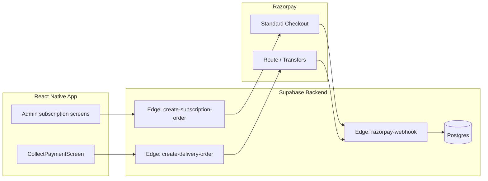

# Razorpay Subscription & Payments — Phase-Wise Implementation Guide

**Purpose:** Actionable implementation roadmap for the Admin + Driver app, derived from [`RAZORPAY_SUBSCRIPTION_AND_PAYMENTS_SCREEN_PLAN.md`](./RAZORPAY_SUBSCRIPTION_AND_PAYMENTS_SCREEN_PLAN.md).

**Scope:** This repo (`WaterTankerAppv1`) — **admin** and **driver** roles only. Customer-app payment screens are tracked in Phase 5 (optional).

**Current baseline (as of this doc):**

| Area | State |
|------|--------|
| Payment gateway | Not integrated; `PaymentService.processOnlinePayment` throws |
| Driver collection | Manual QR image + driver taps “Payment Collected” (`CollectPaymentScreen`) |
| Subscription tables | Designed in `SUBSCRIPTION_IMPLEMENTATION_GUIDE.md` (Paytm-era); **not applied** to Supabase |
| Feature flag | `FEATURE_FLAGS.enableOnlinePayment = false` in `src/constants/config.ts` |
| Razorpay SDK | Not in `package.json` |
| Edge functions | `admin-create-driver`, `admin-delete-user`, `send-email` only |

---

## Table of Contents

1. [Architecture overview](#1-architecture-overview)
2. [Prerequisites & decisions](#2-prerequisites--decisions)
3. [Phase 0 — Foundation](#phase-0--foundation)
4. [Phase 1 — Platform subscription (Flow A)](#phase-1--platform-subscription-flow-a)
5. [Phase 2 — Agency Razorpay Route onboarding (Flow B setup)](#phase-2--agency-razorpay-route-onboarding-flow-b-setup)
6. [Phase 3 — Verified delivery payments (Flow B runtime)](#phase-3--verified-delivery-payments-flow-b-runtime)
7. [Phase 4 — Reporting, reconciliation & polish](#phase-4--reporting-reconciliation--polish)
8. [Phase 5 — Customer app (optional, separate repo)](#phase-5--customer-app-optional-separate-repo)
9. [Cross-cutting concerns](#9-cross-cutting-concerns)
10. [Testing strategy](#10-testing-strategy)
11. [Rollout & rollback](#11-rollout--rollback)
12. [File & deliverable index](#12-file--deliverable-index)

---

## 1. Architecture overview

### Two independent money flows

| Flow | Payer | Payee | Razorpay product | App roles |
|------|-------|-------|------------------|-----------|
| **A — Platform subscription** | Agency admin | Platform owner (your bank) | Standard Checkout | Admin |
| **B — Delivery payment** | Customer (at delivery) | Agency admin (linked account) | Route (Linked Accounts + transfers) | Driver (+ admin setup) |



### Design principles

1. **Never trust client amounts** — order creation and signature verification happen server-side (Edge Functions + service role).
2. **Webhook is source of truth** — SDK success callbacks trigger verify + poll; final state comes from webhook.
3. **Separate checkout contexts** — subscription and delivery orders use different Edge Functions, metadata, and DB tables/ columns.
4. **Feature flag rollback** — `FEATURE_FLAGS.enableOnlinePayment` keeps manual QR path for staging and emergency rollback.

---

## 2. Prerequisites & decisions

Resolve these **before Phase 1 coding** (see also open items in the screen plan §14):

| # | Decision | Recommended default | Impacts |
|---|----------|---------------------|---------|
| 1 | Who subscribes? | Agency **admin** only (not per-driver seat) | Subscription row keyed by `user_id` = admin |
| 2 | Trial period? | 7 days, no card upfront | `subscriptions.is_trial`, `trial_end_date` |
| 3 | Cash / manual QR fallback? | Yes, admin-configurable | `agency_settings.allow_cash_collection` |
| 4 | Platform commission on delivery? | 0% for MVP | Route transfer = 100% to agency |
| 5 | GST on checkout? | Display line item if registered | Order amount from server includes tax |
| 6 | Society period billing | Keep manual (existing `TripDetailsScreen`) | No Razorpay bulk invoice in MVP |
| 7 | Customer app pay-at-booking? | Defer to Phase 5 | Out of scope until Phase 5 |

### Razorpay dashboard setup (platform owner)

- [ ] Create Razorpay merchant account (platform).
- [ ] Enable **Route** (Linked Accounts) for agency payouts.
- [ ] Generate **Key ID** (publishable) + **Key Secret** (server only).
- [ ] Configure **webhook** URL → `https://<project>.supabase.co/functions/v1/razorpay-webhook`.
- [ ] Subscribe webhook events: `payment.captured`, `payment.failed`, `order.paid`, `transfer.processed`, `account.activated` (Route KYC).
- [ ] Add webhook secret to Supabase secrets.

### Environment variables

**Supabase Edge Function secrets** (`supabase secrets set`):

```env
RAZORPAY_KEY_ID=rzp_live_xxx          # or test_
RAZORPAY_KEY_SECRET=xxx               # never in client
RAZORPAY_WEBHOOK_SECRET=xxx
RAZORPAY_PLATFORM_ACCOUNT_ID=acc_xxx  # optional, for Route parent
```

**Expo app** (`.env` — publishable only):

```env
EXPO_PUBLIC_RAZORPAY_KEY_ID=rzp_live_xxx
```

---

## Phase 0 — Foundation

**Goal:** Database schema, shared types, Razorpay SDK wiring, and Edge Function skeletons — no user-facing payment UI yet.

**Estimated effort:** 3–5 days

### 0.1 Database migrations

Create `supabase/migrations/` (if not present) and apply:

#### Migration `001_subscription_plans_and_subscriptions.sql`

Adapt from `SUBSCRIPTION_IMPLEMENTATION_GUIDE.md` with these **Razorpay-specific changes**:

- `payment_transactions.payment_gateway` default `'razorpay'` (not `paytm`).
- Add Razorpay columns:

```sql
-- On payment_transactions
razorpay_order_id VARCHAR(100),
razorpay_payment_id VARCHAR(100),
razorpay_signature VARCHAR(255),

-- On subscriptions (optional, if using Razorpay Subscriptions API later)
razorpay_subscription_id VARCHAR(100)
```

- Extend `subscription_plans.duration_months` CHECK to `(1, 3, 6, 12)` — add **Quarterly** plan.
- Seed four plans: Monthly, Quarterly, Half-yearly, Yearly.

#### Migration `002_agency_razorpay_accounts.sql`

```sql
CREATE TABLE agency_razorpay_accounts (
  id UUID PRIMARY KEY DEFAULT gen_random_uuid(),
  admin_id UUID NOT NULL REFERENCES users(id) ON DELETE CASCADE,
  razorpay_account_id VARCHAR(100),       -- Route linked account id (acc_xxx)
  status VARCHAR(30) NOT NULL DEFAULT 'not_started'
    CHECK (status IN ('not_started', 'created', 'under_review', 'active', 'rejected', 'suspended')),
  rejection_reason TEXT,
  business_name VARCHAR(255),
  contact_name VARCHAR(255),
  contact_email VARCHAR(255),
  contact_phone VARCHAR(20),
  pan VARCHAR(20),
  bank_account_number VARCHAR(50),
  bank_ifsc VARCHAR(20),
  default_collection_method VARCHAR(20) DEFAULT 'manual_qr'
    CHECK (default_collection_method IN ('razorpay', 'manual_qr')),
  allow_cash_collection BOOLEAN DEFAULT true,
  metadata JSONB DEFAULT '{}',
  created_at TIMESTAMPTZ DEFAULT NOW(),
  updated_at TIMESTAMPTZ DEFAULT NOW(),
  UNIQUE(admin_id)
);
```

#### Migration `003_delivery_payment_orders.sql`

```sql
CREATE TABLE delivery_payment_orders (
  id UUID PRIMARY KEY DEFAULT gen_random_uuid(),
  booking_id UUID NOT NULL REFERENCES bookings(id) ON DELETE CASCADE,
  agency_id UUID NOT NULL REFERENCES users(id),
  amount_paise INTEGER NOT NULL,
  currency VARCHAR(3) DEFAULT 'INR',
  razorpay_order_id VARCHAR(100) UNIQUE,
  razorpay_payment_id VARCHAR(100),
  status VARCHAR(20) NOT NULL DEFAULT 'created'
    CHECK (status IN ('created', 'attempted', 'paid', 'failed', 'expired')),
  payment_method VARCHAR(50),  -- upi, card, etc.
  transfer_id VARCHAR(100),  -- Route transfer id
  metadata JSONB DEFAULT '{}',
  created_at TIMESTAMPTZ DEFAULT NOW(),
  updated_at TIMESTAMPTZ DEFAULT NOW()
);

CREATE INDEX idx_delivery_payment_orders_booking ON delivery_payment_orders(booking_id);
CREATE INDEX idx_delivery_payment_orders_agency ON delivery_payment_orders(agency_id);
```

#### Migration `004_rls_and_helpers.sql`

- RLS on all new tables (admin reads own rows; service role writes via Edge Functions).
- Port helper functions: `has_active_subscription(p_user_id)`, `get_current_subscription(p_user_id)`.
- Optional: `get_agency_subscription_status(p_agency_id)` for driver gating.

**Acceptance criteria:**

- [ ] Migrations apply cleanly on Supabase.
- [ ] Seed data includes 4 plans with correct `duration_months`.
- [ ] RLS verified: admin A cannot read admin B's subscription or Route account.

### 0.2 TypeScript types

**File:** `src/types/index.ts`

Add:

```typescript
export type SubscriptionPlanDuration = 1 | 3 | 6 | 12;

export interface SubscriptionPlan {
  id: string;
  name: string;
  description?: string;
  durationMonths: SubscriptionPlanDuration;
  price: number;
  currency: string;
  features: string[];
  isActive: boolean;
  displayOrder: number;
}

export interface UserSubscription {
  id: string;
  userId: string;
  planId: string;
  status: 'pending' | 'active' | 'expired' | 'cancelled' | 'paused';
  startDate?: Date;
  endDate?: Date;
  autoRenew: boolean;
  isTrial: boolean;
  trialEndDate?: Date;
  plan?: SubscriptionPlan;
}

export interface PaymentTransaction {
  id: string;
  userId: string;
  subscriptionId?: string;
  amount: number;
  currency: string;
  paymentGateway: 'razorpay';
  gatewayOrderId?: string;
  gatewayTransactionId?: string;
  status: 'pending' | 'processing' | 'success' | 'failed' | 'refunded' | 'cancelled';
  paymentMethod?: string;
  initiatedAt: Date;
  completedAt?: Date;
}

export interface AgencyRazorpayAccount {
  id: string;
  adminId: string;
  razorpayAccountId?: string;
  status: 'not_started' | 'created' | 'under_review' | 'active' | 'rejected' | 'suspended';
  rejectionReason?: string;
  defaultCollectionMethod: 'razorpay' | 'manual_qr';
  allowCashCollection: boolean;
  // ... KYC fields
}

export interface DeliveryPaymentOrder {
  id: string;
  bookingId: string;
  agencyId: string;
  amountPaise: number;
  razorpayOrderId?: string;
  razorpayPaymentId?: string;
  status: 'created' | 'attempted' | 'paid' | 'failed' | 'expired';
}
```

Extend `Booking` usage in UI to always show `paymentStatus` and `paymentId` (already on type).

### 0.3 Data access layer

**Files:** `src/lib/supabaseDataAccess.ts`, `src/lib/dataAccess.interface.ts`

Add repositories:

| Repository | Methods |
|------------|---------|
| `subscriptionPlans` | `getActivePlans()`, `getPlanById(id)` |
| `subscriptions` | `getCurrentSubscription(userId)`, `createPending(...)`, `activate(...)` |
| `paymentTransactions` | `listByUser(userId)`, `create(...)`, `updateStatus(...)` |
| `agencyRazorpayAccounts` | `getByAdminId`, `upsert`, `updateStatus` |
| `deliveryPaymentOrders` | `getByBookingId`, `create`, `updateFromWebhook` |

### 0.4 Install Razorpay React Native SDK

```bash
npx expo install react-native-razorpay
```

Add config plugin if required for EAS builds. Document in README that **dev client rebuild** is required after native module install.

**Wrapper:** `src/services/razorpayCheckout.service.ts`

- `openCheckout({ orderId, amount, currency, name, description, prefill })`
- Handles user cancel vs failure
- Returns `{ success, paymentId, orderId, signature }` for server verify

### 0.5 Edge Function skeletons

| Function | Method | Auth | Purpose |
|----------|--------|------|---------|
| `create-subscription-order` | POST | Admin JWT | Create Razorpay order + DB `payment_transactions` row |
| `verify-subscription-payment` | POST | Admin JWT | Verify signature; activate subscription |
| `create-delivery-order` | POST | Driver JWT | Create order with Route `transfers` to agency `account_id` |
| `verify-delivery-payment` | POST | Driver JWT | Verify signature; update booking |
| `razorpay-webhook` | POST | Webhook signature | Idempotent status updates |
| `create-linked-account` | POST | Admin JWT | Start Route linked account (Phase 2) |
| `get-linked-account-status` | GET | Admin JWT | Poll KYC status (Phase 2) |

Each function:

- Validates JWT via Supabase `auth.getUser()`.
- Uses `RAZORPAY_KEY_SECRET` only inside Edge Function.
- Returns structured errors `{ code, message }` for UI.

**Acceptance criteria:**

- [ ] `create-subscription-order` returns `{ orderId, amount, currency, keyId }` in Razorpay test mode.
- [ ] Webhook handler verifies `X-Razorpay-Signature` and rejects invalid payloads.
- [ ] Unit tests for signature verification utility (shared `_shared/razorpay.ts`).

### 0.6 Config & constants

**File:** `src/constants/config.ts`

```typescript
export const RAZORPAY_CONFIG = {
  keyId: process.env.EXPO_PUBLIC_RAZORPAY_KEY_ID ?? '',
  companyName: 'Water Tanker Hub', // platform legal name on checkout
};

export const SUBSCRIPTION_CONFIG = {
  expiringSoonDays: 7,
  gracePeriodDays: 0, // set if allowing post-expiry read-only
};
```

Keep `FEATURE_FLAGS.enableOnlinePayment = false` until Phase 3.

---

## Phase 1 — Platform subscription (Flow A)

**Goal:** Agency admins pay the platform; app access is gated on active subscription.

**Estimated effort:** 5–8 days

**Depends on:** Phase 0 complete.

### 1.1 New services

**File:** `src/services/subscription.service.ts`

| Method | Description |
|--------|-------------|
| `getPlans()` | Fetch active plans from DB |
| `getCurrentSubscription()` | Current admin subscription + plan |
| `hasActiveSubscription()` | Boolean for gating |
| `createCheckoutSession(planId)` | Calls `create-subscription-order` Edge Function |
| `verifyPayment(orderId, paymentId, signature)` | Calls verify Edge Function |
| `getPaymentHistory()` | Lists `payment_transactions` for admin |
| `cancelSubscription(reason?)` | Sets status cancelled (no refund logic in MVP) |

**File:** `src/store/subscriptionStore.ts` (Zustand)

- Cache plans, current subscription, loading/error state.
- Refresh on login and after payment.

### 1.2 New screens (admin)

**Directory:** `src/screens/admin/subscription/`

| Screen | File | Key behavior |
|--------|------|--------------|
| Subscription Plans | `SubscriptionPlansScreen.tsx` | 4 plan cards, savings badges, CTA → checkout |
| Subscription Checkout | `SubscriptionCheckoutScreen.tsx` | Summary + “Pay with Razorpay” → SDK → verify |
| Subscription Status | `SubscriptionStatusScreen.tsx` | Active/expired chip, renew, cancel, link to history |
| Subscription Payment History | `SubscriptionPaymentHistoryScreen.tsx` | List transactions with Razorpay ids |

**Shared:** `src/screens/shared/PaymentResultScreen.tsx`

- Params: `{ type: 'subscription' | 'delivery', status, referenceId?, message? }`
- Success / failure / pending (poll `verify` or subscription status)

### 1.3 Navigation & menu

**Files:** `AdminNavigator.tsx`, `AdminMenuDrawer.tsx`

Extend `AdminStackParamList`:

```typescript
SubscriptionPlans: undefined;
SubscriptionCheckout: { planId: string };
SubscriptionStatus: undefined;
SubscriptionPaymentHistory: undefined;
PaymentResult: {
  type: 'subscription' | 'delivery';
  status: 'success' | 'failed' | 'pending';
  referenceId?: string;
};
```

Drawer item: **Subscription** (badge if expiring ≤ 7 days).

### 1.4 Auth & root gating

**Files:** `App.tsx`, `LoginScreen.tsx`, `RegisterScreen.tsx`, `AdminProfileScreen.tsx`

| Location | Change |
|----------|--------|
| `App.tsx` | After admin auth, if `!hasActiveSubscription()` → reset admin stack to `SubscriptionPlans` (allow Profile + Payment History in limited mode) |
| `RegisterScreen` | Post email verification path → `SubscriptionPlans` with copy: “Choose a plan to activate your agency account” |
| `LoginScreen` | Expired subscription → same limited stack |
| `AdminProfileScreen` | Top card: plan name, expiry, **Renew** → `SubscriptionStatus` |

**Driver behavior when agency subscription inactive:**

- `OrdersScreen` banner: “Agency account inactive — contact admin.”
- Disable start delivery / collect payment actions.

### 1.5 Backend completion (Edge Functions)

**`create-subscription-order` flow:**

1. Validate admin role and `planId`.
2. Load plan price from DB (never from client body amount).
3. Create Razorpay order (`amount` in paise, `receipt` = internal txn id).
4. Insert `payment_transactions` status `pending`.
5. Return order details to client.

**`verify-subscription-payment` + webhook flow:**

1. Verify HMAC signature (`order_id|payment_id`).
2. Idempotent update: if already `success`, return OK.
3. Upsert `subscriptions`: set `active`, `start_date`, `end_date` += `duration_months`.
4. Mark transaction `success`.

### 1.6 Tests

| Test | Location |
|------|----------|
| `hasActiveSubscription` logic (trial, expired, active) | `src/__tests__/services/subscription.service.test.ts` |
| Plan list rendering | `src/__tests__/screens/admin/SubscriptionPlansScreen.test.tsx` |
| Navigation gate when expired | `src/__tests__/navigation/App.test.tsx` |
| Edge function signature verify | Deno test in `supabase/functions/_shared/` |

**Phase 1 acceptance criteria:**

- [ ] New admin can register → verify email → select plan → pay (test mode) → land on Bookings.
- [ ] Expired admin sees blocking subscription flow on login.
- [ ] Payment history shows successful Razorpay payment id.
- [ ] Drivers under inactive agency see inactive message.
- [ ] No delivery Razorpay changes yet (`enableOnlinePayment` still false).

---

## Phase 2 — Agency Razorpay Route onboarding (Flow B setup)

**Goal:** Agencies complete linked-account KYC so delivery payments can settle to them.

**Estimated effort:** 5–7 days

**Depends on:** Phase 0 schema; Phase 1 can ship in parallel if Route onboarding is not blocking subscription.

### 2.1 Edge Functions (Route)

**`create-linked-account`:**

1. Validate admin JWT.
2. If account exists and `active`, return early.
3. Call Razorpay Route API: create linked account + stakeholder + product configuration.
4. Store `razorpay_account_id`, set status `created` / `under_review`.
5. Optionally return hosted onboarding URL if using Account onboarding.

**`get-linked-account-status`:**

- Poll Razorpay account status; map to `agency_razorpay_accounts.status`.
- Handle webhook `account.activated` / rejection events in `razorpay-webhook`.

### 2.2 New screen

**File:** `src/screens/admin/payments/RazorpayAccountSetupScreen.tsx`

**UI:**

- Step indicator: Details → KYC → Activation
- Form fields per Razorpay Route docs (business name, PAN, bank, IFSC, contact)
- Status chip: Not started / Under review / Active / Rejected (+ reason)
- CTA: Submit → poll status / open hosted onboarding WebView

**Service:** `src/services/agencyPayout.service.ts`

- `getAccountStatus()`, `submitOnboarding(data)`, `refreshStatus()`

### 2.3 Refactor Payments hub

**File:** `src/screens/admin/AddBankAccountScreen.tsx`

Evolve into tabbed **Payments & Payouts** hub:

| Section | Content |
|---------|---------|
| Online payouts (Razorpay) | Status summary + navigate to `RazorpayAccountSetupScreen` |
| Manual QR (fallback) | Existing QR upload (`BankAccountService`) |
| Default collection method | Radio: Razorpay online / Manual QR only |
| Allow cash collection | Toggle (admin setting → `allow_cash_collection`) |

**Menu:** Rename drawer item **Add Bank Account** → **Payments & Payouts**.

**Profile card:** Payout account Active / Setup required → deep link to setup.

### 2.4 Navigation

Add routes:

```typescript
RazorpayAccountSetup: undefined;
// AgencyPayouts deferred to Phase 4
```

### 2.5 Admin banner (non-blocking)

When subscription active but Route **not** active:

- Persistent banner on admin screens: “Complete payout setup to enable online delivery payments.”
- Drivers continue manual QR / cash only.

**Phase 2 acceptance criteria:**

- [ ] Admin submits KYC → status progresses to `active` (test mode Route).
- [ ] `agency_razorpay_accounts` row created and updated via webhook/poll.
- [ ] Payments hub shows both Razorpay status and manual QR.
- [ ] Default collection method persisted and readable by driver flow (Phase 3).

---

## Phase 3 — Verified delivery payments (Flow B runtime)

**Goal:** Replace unverified “Payment Collected” with Razorpay checkout; booking completes only after verified payment (or explicit cash fallback).

**Estimated effort:** 7–10 days

**Depends on:** Phase 2 for online path; Phase 0 delivery order table.

### 3.1 Enable feature flag (staging first)

```typescript
// src/constants/config.ts
enableOnlinePayment: true, // staging only initially
```

### 3.2 Edge Functions (delivery)

**`create-delivery-order`:**

1. Validate driver JWT; driver must belong to booking’s agency.
2. Booking status must be `in_transit` (or project-specific rule).
3. Load `deliveredAmount` from booking (set by driver modal first).
4. Load agency `razorpay_account_id`; error if missing and online required.
5. Create Razorpay order with `transfers: [{ account: acc_xxx, amount, currency }]`.
6. Insert `delivery_payment_orders` row.

**`verify-delivery-payment` + webhook:**

1. Verify signature.
2. Update `delivery_payment_orders.status = paid`.
3. Update `bookings.payment_status = completed`, `payment_id`, `status = delivered`.
4. Idempotent on duplicate webhook delivery.

### 3.3 Payment service refactor

**File:** `src/services/payment.service.ts`

Replace stub with:

| Method | When |
|--------|------|
| `createDeliveryPayment(bookingId, amount)` | Before opening Razorpay |
| `verifyDeliveryPayment(bookingId, paymentResponse)` | After SDK callback |
| `recordCashPayment(bookingId, note?)` | Admin allowed cash fallback |
| `confirmCODPayment` | Deprecated or wraps cash path |

### 3.4 Critical UI: CollectPaymentScreen

**File:** `src/screens/driver/CollectPaymentScreen.tsx`

| Step | Implementation |
|------|----------------|
| 1 | Keep `AmountInputModal` — persist `deliveredAmount` / liters |
| 2 | If `enableOnlinePayment` && agency Route active → show **Collect payment (₹X)** |
| 3 | Open Razorpay checkout via `razorpayCheckout.service` |
| 4 | Show states: `pending` · `processing` · `paid` · `failed` |
| 5 | Disable **Payment Collected** until `payment_status === 'completed'` OR cash path used |
| 6 | Secondary: **Share payment link** (optional: Razorpay Payment Links API) |
| 7 | Error state if agency not onboarded: “Contact admin — online payments unavailable” |
| 8 | Cash button if `allow_cash_collection` → audit log + manual complete |

**Realtime (optional but recommended):**

- Subscribe to `bookings` UPDATE for `payment_status` while screen mounted (webhook may arrive before SDK returns).

### 3.5 Driver orders list

**Files:** `OrdersList.tsx`, `OrdersScreen.tsx`

- Payment badge: Unpaid / Paid / Cash / Failed
- **Collect Payment** only when eligible; disabled if agency Route inactive (online mode)
- **Retry payment** on failed state

### 3.6 Shared PaymentResultScreen (driver stack)

**File:** `DriverNavigator.tsx`

- Add `PaymentResult` route (or shared modal)
- `CollectPayment` params may include `paymentOrderId`

### 3.7 Driver earnings

**File:** `DriverEarningsScreen.tsx`

- Add: **Revenue collected (online)** vs **Pending payment**
- Disclaimer on Razorpay settlement timing (2–3 business days)

**Phase 3 acceptance criteria:**

- [ ] End-to-end test delivery: amount entry → Razorpay test UPI → webhook → booking `delivered` + `payment_status=completed`.
- [ ] Driver cannot complete delivery with online mode without verified payment.
- [ ] Cash fallback works when enabled; recorded distinctly in DB (`payment_method = 'cash'`).
- [ ] Feature flag `false` restores legacy QR + manual confirm with no regression.
- [ ] Funds transfer metadata stored (`transfer_id` on `delivery_payment_orders`).

---

## Phase 4 — Reporting, reconciliation & polish

**Goal:** Admin visibility into payouts and delivery payments; booking/report filters; auth polish.

**Estimated effort:** 4–6 days

**Depends on:** Phase 3 producing real transaction rows.

### 4.1 New admin screens

**Directory:** `src/screens/admin/payments/`

| Screen | Purpose |
|--------|---------|
| `AgencyPayoutsScreen.tsx` | Summary cards (today / week / month); list settlements & per-booking credits |
| `DeliveryPaymentHistoryScreen.tsx` | All delivery Razorpay txns for agency |

### 4.2 Existing screen updates

| Screen | Changes |
|--------|---------|
| `AllBookingsScreen.tsx` | Payment chips (Pending/Paid/Failed/Cash); filter “Unpaid deliveries” |
| `TripDetailsScreen.tsx` | Label split: “Delivery payments (Razorpay)” vs “Society billing periods” |
| `ReportsScreen.tsx` | Sections: Delivery collections (Razorpay), Pending collections; **exclude** platform subscription from agency export |
| `LoginScreen.tsx` / `RegisterScreen.tsx` | Final copy pass for subscription + payout banners |

### 4.3 Navigation

Add drawer item **Payout history** (or subsection under Payments hub):

```typescript
AgencyPayouts: undefined;
DeliveryPaymentHistory: undefined;
```

### 4.4 Reporting queries

**Service methods in `agencyPayout.service.ts`:**

- `getPayoutSummary(dateRange)`
- `listDeliveryPayments(filters)`
- Reuse `reportCalculations.ts` where possible for aggregates

### 4.5 Excel export (optional)

**File:** `src/utils/excelExport.ts`

- Add sheet: Delivery payments with Razorpay ids (not subscription fees).

**Phase 4 acceptance criteria:**

- [ ] Admin sees accurate totals matching Razorpay dashboard (test reconciliation).
- [ ] Unpaid delivery filter returns correct bookings.
- [ ] Society period UI unchanged functionally; labels clarified.
- [ ] Expiring subscription badge on drawer item works.

---

## Phase 5 — Customer app (optional, separate repo)

**Goal:** Pay at booking time from customer mobile app (not driver device).

**Not in this repo today** — track as separate project.

| Screen | Purpose |
|--------|---------|
| `PayBookingScreen` | Prepay on booking confirmation |
| `MyPaymentsScreen` | Customer payment history |

**Rules:**

- Same Route transfer logic — `agency_id` on order metadata.
- Reuse Edge Functions pattern from Phase 3 (may extract shared `create-customer-booking-order`).

---

## 9. Cross-cutting concerns

### Security

| Rule | Implementation |
|------|----------------|
| Secret keys server-only | Edge Functions env; never in Expo bundle |
| Amount integrity | Server reads plan/booking amount from DB |
| Webhook idempotency | Unique constraint on `razorpay_payment_id`; upsert handlers |
| RLS | Admins read own financial rows only |
| Driver scope | Driver can only create orders for assigned agency bookings |

### Error handling

Map Razorpay errors to `ERROR_MESSAGES.payment` in `config.ts`:

- User cancelled
- Network timeout
- Signature mismatch
- Agency not onboarded

Use existing `handleError` / `errorLogger` patterns.

### Analytics (optional)

**File:** `src/utils/analytics.ts`

Events: `subscription_checkout_started`, `subscription_payment_success`, `delivery_payment_started`, `delivery_payment_failed`, `cash_payment_recorded`.

### Society payments

**No change in Phases 1–4** to society period bulk flow (`societyPaymentPeriods.service.ts`). Keep manual marking; UI labels only in Phase 4.

---

## 10. Testing strategy

### Environments

| Environment | Razorpay mode | Flag |
|-------------|---------------|------|
| Local / dev client | Test keys | `enableOnlinePayment: true` |
| Staging EAS | Test keys | `true` |
| Production | Live keys | Gradual rollout |

### Test matrix (minimum)

| Scenario | Phase |
|----------|-------|
| Admin subscribes monthly (test card/UPI) | 1 |
| Admin renews before expiry | 1 |
| Admin blocked when expired | 1 |
| Driver blocked when agency expired | 1 |
| Linked account KYC happy path | 2 |
| Linked account rejected | 2 |
| Delivery Razorpay success | 3 |
| Delivery payment failed + retry | 3 |
| Cash fallback with audit | 3 |
| Manual QR when flag off | 3 |
| Webhook duplicate delivery (idempotent) | 0–3 |
| Payout summary matches orders | 4 |

### Manual QA checklist

Document in `docs/QA_RAZORPAY_CHECKLIST.md` (create when Phase 1 starts).

---

## 11. Rollout & rollback

### Rollout order

1. Phase 0 + 1 to production → subscription revenue live.
2. Phase 2 → onboard pilot agencies on Route.
3. Phase 3 with `enableOnlinePayment: true` for pilot agency ids only (optional remote config).
4. Phase 4 for all admins with online payments enabled.

### Rollback

| Issue | Action |
|-------|--------|
| Delivery checkout broken | Set `enableOnlinePayment: false`; manual QR path resumes |
| Subscription verify broken | Disable new checkouts; extend `end_date` manually for affected admins |
| Webhook outage | Edge Function logs + manual reconcile from Razorpay dashboard |

---

## 12. File & deliverable index

### New files (by phase)

| Phase | Paths |
|-------|-------|
| 0 | `supabase/migrations/*.sql`, `supabase/functions/create-subscription-order/`, `verify-subscription-payment/`, `create-delivery-order/`, `verify-delivery-payment/`, `razorpay-webhook/`, `supabase/functions/_shared/razorpay.ts`, `src/services/razorpayCheckout.service.ts`, `src/services/subscription.service.ts` |
| 1 | `src/screens/admin/subscription/*.tsx`, `src/screens/shared/PaymentResultScreen.tsx`, `src/store/subscriptionStore.ts` |
| 2 | `src/screens/admin/payments/RazorpayAccountSetupScreen.tsx`, `src/services/agencyPayout.service.ts`, `create-linked-account/`, `get-linked-account-status/` |
| 3 | Heavy edit `CollectPaymentScreen.tsx`, `payment.service.ts` |
| 4 | `AgencyPayoutsScreen.tsx`, `DeliveryPaymentHistoryScreen.tsx` |

### Modified files (all phases)

| File | Phases |
|------|--------|
| `App.tsx` | 1 |
| `AdminNavigator.tsx`, `AdminMenuDrawer.tsx` | 1, 2, 4 |
| `DriverNavigator.tsx` | 3 |
| `AdminProfileScreen.tsx` | 1, 2 |
| `AddBankAccountScreen.tsx` | 2 |
| `OrdersList.tsx`, `OrdersScreen.tsx`, `DriverEarningsScreen.tsx` | 3 |
| `AllBookingsScreen.tsx`, `TripDetailsScreen.tsx`, `ReportsScreen.tsx` | 4 |
| `LoginScreen.tsx`, `RegisterScreen.tsx` | 1, 4 |
| `src/constants/config.ts` | 0, 3 |
| `src/types/index.ts` | 0 |
| `src/lib/supabaseDataAccess.ts` | 0–4 |
| `package.json` | 0 |

---

## Phase summary timeline

| Phase | Focus | User-visible outcome |
|-------|-------|----------------------|
| **0** | Foundation | Schema + APIs ready; no UI |
| **1** | Flow A | Admins subscribe; app gated |
| **2** | Flow B setup | Agencies onboard for payouts |
| **3** | Flow B runtime | Verified delivery payments |
| **4** | Reporting | Payout history & filters |
| **5** | Customer app | Optional prepay (other repo) |

**Suggested total:** 4–6 weeks with one developer, assuming Razorpay test account and Supabase access are ready on day one.

---

## References

- Screen UX spec: [`RAZORPAY_SUBSCRIPTION_AND_PAYMENTS_SCREEN_PLAN.md`](./RAZORPAY_SUBSCRIPTION_AND_PAYMENTS_SCREEN_PLAN.md)
- Legacy Paytm/schema notes: [`SUBSCRIPTION_IMPLEMENTATION_GUIDE.md`](../SUBSCRIPTION_IMPLEMENTATION_GUIDE.md) (adapt gateway columns to Razorpay)
- Razorpay docs: [Standard Checkout](https://razorpay.com/docs/payments/payment-gateway/web-integration/standard/), [Route / Linked Accounts](https://razorpay.com/docs/route/), [Webhooks](https://razorpay.com/docs/webhooks/)

---

*Document version: 1.0 — implementation roadmap. Align with screen plan v1.0.*
