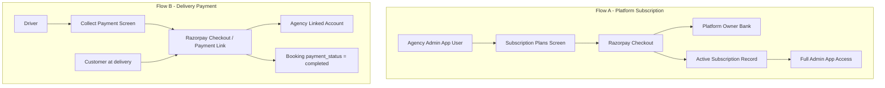

# Razorpay Subscription & In-App Payments — Screen Change Plan

> **OBSOLETE (2026-07-10):** Razorpay delivery payments and Route (linked accounts / payouts)
> have been removed. Drivers now collect delivery payments via the agency QR code or cash
> (see `docs/superpowers/specs/2026-07-10-remove-razorpay-delivery-payments-design.md`).
> Razorpay is used only for agency platform subscriptions. Delivery/Route sections below
> are historical.

**Purpose:** Review document for implementing two separate payment flows using **Razorpay**, without code changes in this phase.

**App context:** This repository is the **Admin + Driver** mobile app (`admin` and `driver` roles only). Customers use a separate app (linked from `RoleEntryScreen`). Screen changes below apply to this app unless noted for the customer app.

**Related doc:** `SUBSCRIPTION_IMPLEMENTATION_GUIDE.md` (older Paytm-focused, customer-subscription oriented). This plan replaces the gateway with Razorpay and aligns flows with **your** business model.

---

## Table of Contents

1. [Business model summary](#1-business-model-summary)
2. [Razorpay setup (high level)](#2-razorpay-setup-high-level)
3. [Money flows](#3-money-flows)
4. [Screen inventory at a glance](#4-screen-inventory-at-a-glance)
5. [New screens](#5-new-screens)
6. [Existing screens to modify](#6-existing-screens-to-modify)
7. [Screens with no UI change](#7-screens-with-no-ui-change)
8. [Navigation & menu changes](#8-navigation--menu-changes)
9. [Auth & access gating](#9-auth--access-gating)
10. [User journeys](#10-user-journeys)
11. [Customer app (separate) — optional screens](#11-customer-app-separate--optional-screens)
12. [Platform owner / super-admin](#12-platform-owner--super-admin)
13. [Implementation phases (screens only)](#13-implementation-phases-screens-only)
14. [Open decisions for your review](#14-open-decisions-for-your-review)

---

## 1. Business model summary

| Flow | Who pays | Who receives | When | Current app behavior |
|------|----------|--------------|------|----------------------|
| **A. Platform subscription** | Agency admin (platform user) | **Your** bank account (platform owner) | On subscribe / renew | Not implemented |
| **B. Delivery (in-app) payment** | Customer (at delivery) | **That booking’s agency admin** only | When delivery is completed & paid | Manual QR + driver taps “Payment Collected” |

**Subscription cadence:** Monthly · Quarterly (3 mo) · Half-yearly (6 mo) · Yearly (12 mo).

**Important:** These are two different Razorpay configurations. Do not mix subscription checkout with delivery checkout on the same screen without clear labeling.

---

## 2. Razorpay setup (high level)

Screen design depends on which Razorpay products you enable:

| Product | Used for | Screen impact |
|---------|----------|----------------|
| **Razorpay Standard Checkout** | Flow A — admin pays you for subscription | Checkout WebView / native SDK on subscription screens |
| **Razorpay Route** (Linked Accounts) | Flow B — customer payment settles to agency | Agency must complete **linked account / KYC** before receiving payouts; onboarding UI on admin side |
| **Webhooks** (backend, not a screen) | Verify payment success before unlocking features | Success/failure/ pending states on all payment screens |

**Settlement:**

- **Flow A:** Payments go to your Razorpay merchant account → settle to **your** linked bank.
- **Flow B:** Create order with `transfer` to agency’s `account_id` (Route) so only that admin’s linked account is credited (minus Razorpay fees / optional platform commission if you add one later).

---

## 3. Money flows



---

## 4. Screen inventory at a glance

### New screens (recommended)

| # | Screen | Role | Flow |
|---|--------|------|------|
| 1 | `SubscriptionPlansScreen` | Admin | A |
| 2 | `SubscriptionCheckoutScreen` | Admin | A |
| 3 | `SubscriptionStatusScreen` | Admin | A |
| 4 | `SubscriptionPaymentHistoryScreen` | Admin | A |
| 5 | `RazorpayAccountSetupScreen` | Admin | B (onboarding) |
| 6 | `AgencyPayoutsScreen` | Admin | B (settlements view) |
| 7 | `PaymentResultScreen` | Admin / Driver | A & B (shared success/fail) |
| 8 | `DeliveryPaymentHistoryScreen` | Admin | B |

### Existing screens to modify

| Screen | Path | Priority |
|--------|------|----------|
| Admin profile | `src/screens/admin/AdminProfileScreen.tsx` | High |
| Bank accounts | `src/screens/admin/AddBankAccountScreen.tsx` | High |
| Admin menu drawer | `src/components/common/AdminMenuDrawer.tsx` | High |
| Collect payment | `src/screens/driver/CollectPaymentScreen.tsx` | **Critical** |
| Driver orders list | `src/screens/driver/OrdersScreen.tsx` + `OrdersList.tsx` | High |
| Driver earnings | `src/screens/driver/DriverEarningsScreen.tsx` | Medium |
| All bookings | `src/screens/admin/AllBookingsScreen.tsx` | Medium |
| Trip details | `src/screens/admin/TripDetailsScreen.tsx` | Medium |
| Reports | `src/screens/admin/ReportsScreen.tsx` | Medium |
| Login / Register | `src/screens/auth/LoginScreen.tsx`, `RegisterScreen.tsx` | Medium |
| App root routing | `App.tsx` | High (subscription gate) |

### No screen change (likely)

| Screen | Reason |
|--------|--------|
| `RoleEntryScreen` | Role selection only; optional one-line note that admin requires subscription |
| `DriverManagementScreen`, `VehicleManagementScreen`, `ExpenseScreen` | Operational; gated indirectly if subscription inactive |
| `PendingEmailVerificationScreen` | Unchanged |

---

## 5. New screens

### 5.1 `SubscriptionPlansScreen` (Admin — Flow A)

**Purpose:** Choose billing period before payment.

**UI elements:**

- Four plan cards: **Monthly**, **Quarterly**, **Half-yearly**, **Yearly**
- Price per plan (from backend / `subscription_plans` table)
- Savings badge on longer plans (e.g. “Save 15% vs monthly”)
- Feature list (what subscription unlocks: bookings, drivers, reports, etc.)
- CTA: **Subscribe** → navigates to `SubscriptionCheckoutScreen` with `planId`
- If already subscribed: show current plan + **Manage** → `SubscriptionStatusScreen`

**Entry points:**

- Subscription gate modal when admin has no active plan
- Admin profile → “Subscription”
- Admin drawer menu → “Subscription”

---

### 5.2 `SubscriptionCheckoutScreen` (Admin — Flow A)

**Purpose:** Start Razorpay checkout for platform fee.

**UI elements:**

- Order summary: plan name, duration, amount, GST if applicable
- **Pay with Razorpay** button
- Legal text: charges go to platform operator (your business name)
- Loading while creating order (server-side)
- On return: navigate to `PaymentResultScreen` with `type: 'subscription'`

**Notes:**

- Do not collect card/UPI details in custom inputs; use Razorpay SDK / hosted checkout only.
- Amount must come from server-created order, not hardcoded in UI.

---

### 5.3 `SubscriptionStatusScreen` (Admin — Flow A)

**Purpose:** View and manage active subscription.

**UI elements:**

- Status chip: Active · Expiring soon · Expired · Pending payment
- Plan name, start date, end date, auto-renew toggle (if supported)
- **Renew / Upgrade plan** → `SubscriptionPlansScreen`
- **View payment history** → `SubscriptionPaymentHistoryScreen`
- **Cancel subscription** (if you allow) with confirmation dialog

---

### 5.4 `SubscriptionPaymentHistoryScreen` (Admin — Flow A)

**Purpose:** List all subscription charges to platform.

**UI elements:**

- List: date, amount, plan, Razorpay payment id, status (success/failed/refunded)
- Tap row → receipt detail (optional modal)
- Empty state when no payments

---

### 5.5 `RazorpayAccountSetupScreen` (Admin — Flow B)

**Purpose:** Connect agency to Razorpay Route so delivery payments credit **their** account.

**Replaces / extends:** Part of today’s `AddBankAccountScreen` (QR-only) workflow.

**UI elements:**

- Step indicator: Account details → KYC → Activation
- Fields aligned with Razorpay linked account: business name, contact, PAN, bank account, IFSC (exact fields per Razorpay docs)
- Status: Not started · Under review · Active · Rejected (with reason)
- Warning if not active: “Online delivery payments disabled — drivers can only record cash or manual QR”
- Link to Razorpay hosted onboarding if you use Account onboarding API

**Entry points:**

- First-time banner on `AddBankAccountScreen`
- Admin drawer → rename **Add Bank Account** to **Payments & Payouts** (hub screen) with sections

---

### 5.6 `AgencyPayoutsScreen` (Admin — Flow B)

**Purpose:** Transparency for agency owner on money received from deliveries.

**UI elements:**

- Summary cards: Today / This week / This month — **collected via Razorpay** vs **pending**
- List of settlements or per-booking credits (booking id, customer, amount, date, Razorpay payment id)
- Filter by date range
- Export optional (later phase)

**Entry points:**

- Admin drawer → **Payouts** or subsection under Reports

---

### 5.7 `PaymentResultScreen` (Admin & Driver — shared)

**Purpose:** Single place after Razorpay redirect / SDK callback.

**Params:** `type: 'subscription' | 'delivery'`, `status`, `referenceId`

**UI elements:**

- Success: icon, message, primary CTA (Go to dashboard / Back to order)
- Failure: reason, **Retry payment**
- Pending: “Payment processing…” with pull-to-refresh or auto-poll

---

### 5.8 `DeliveryPaymentHistoryScreen` (Admin — Flow B)

**Purpose:** All delivery-related Razorpay transactions for this agency.

**Difference from 5.4:** Subscription history is platform→you; this is customer→agency per booking.

**UI elements:**

- Table/list tied to `bookingId`, customer name, driver, amount, `payment_status`, date
- Failed payments with retry action (if customer pays via link sent by admin — optional phase)

---

## 6. Existing screens to modify

### 6.1 `CollectPaymentScreen` — **Critical** (`src/screens/driver/CollectPaymentScreen.tsx`)

**Current behavior:**

- Shows amount and admin’s **static QR image**
- Driver taps **Payment Collected** → marks delivery complete without verifying payment

**Target behavior:**

| Step | UI change |
|------|-----------|
| 1 | Keep delivery amount modal (`AmountInputModal`) — save `deliveredAmount` / liters first |
| 2 | Replace “Scan QR Code” section with **Pay via Razorpay** (customer pays on driver’s device OR payment link) |
| 3 | Show payment state: `pending` · `processing` · `paid` · `failed` |
| 4 | **Payment Collected** disabled until webhook confirms `payment_status === 'completed'` (or SDK success callback + server verify) |
| 5 | Optional: **Record cash payment** (admin setting) — bypass Razorpay with reason + admin audit flag |
| 6 | On success → mark booking `delivered` + store `paymentId` |

**Additional UI:**

- Primary CTA: **Collect payment (₹X)** → opens Razorpay
- Secondary: **Share payment link** (SMS/WhatsApp) if customer pays on their phone
- Error if agency Razorpay account not active: “Agency cannot accept online payments — contact admin”

---

### 6.2 `OrdersScreen` + `OrdersList` (Driver)

**Changes:**

- On each order card, show payment badge: Unpaid / Paid / Cash
- **Collect Payment** only for `in_transit` (or your current rules); disable if agency payout account inactive
- After failed payment, show **Retry payment** on card

---

### 6.3 `DriverEarningsScreen`

**Current:** Order counts (completed today/week/month).

**Add:**

- **Revenue collected (online)** vs **pending payment** (sum of `deliveredAmount` where `payment_status` pending)
- Disclaimer: “Earnings reflect completed deliveries; online payments may settle in 2–3 business days” (Razorpay settlement wording)
- Do not show platform subscription info here (driver does not pay subscription)

---

### 6.4 `AddBankAccountScreen` → evolve into **Payments hub**

**Current:** Bank name + QR image upload for manual UPI.

**Proposed structure (single screen or tabs):**

| Tab / section | Content |
|---------------|---------|
| **Online payouts (Razorpay)** | Status + link to `RazorpayAccountSetupScreen` |
| **Manual QR (optional fallback)** | Keep existing QR upload for cash/UPI-off-app |
| **Default collection method** | Radio: Razorpay online / Manual QR only |

**Copy change:** Menu label **Add Bank Account** → **Payments & Payouts**

---

### 6.5 `AdminProfileScreen`

**Add card at top:**

- Subscription: plan name, expiry, **Renew** button
- Payout account: Active / Setup required (links to Razorpay setup)
- Red banner if subscription expired or payout not configured

---

### 6.6 `AdminMenuDrawer` + `AdminNavigator`

**New routes to register:**

```text
SubscriptionPlans
SubscriptionCheckout
SubscriptionStatus
SubscriptionPaymentHistory
RazorpayAccountSetup
AgencyPayouts
DeliveryPaymentHistory
PaymentResult
```

**New drawer items (suggested order):**

1. Bookings  
2. Trip details  
3. … (existing)  
4. **Subscription** (or badge if expiring)  
5. **Payments & Payouts** (replaces “Add Bank Account”)  
6. **Payout history** (optional separate or under Payments hub)  
7. Profile  

---

### 6.7 `AllBookingsScreen`

**Add columns / chips:**

- Payment: Pending · Paid · Failed · Cash
- Filter: “Unpaid deliveries”
- Tap booking → detail sheet with payment id + retry (admin-only retry if you send customer a new link)

---

### 6.8 `TripDetailsScreen`

**Already has:** Society **payment period** completion tracking (monthly bulk society payments).

**Clarify in UI:**

- **Per-delivery Razorpay payment** (driver flow) vs **Society period settlement** (existing modal) — use distinct labels to avoid admin confusion, e.g.:
  - “Delivery payments (Razorpay)”
  - “Society billing periods” (existing)

**Optional:** Link from period modal to bookings with unpaid `payment_status`.

---

### 6.9 `ReportsScreen`

**Add report sections:**

| Section | Data |
|---------|------|
| Delivery collections (Razorpay) | Sum of paid bookings in period |
| Pending collections | Delivered but unpaid |
| Subscription | N/A on agency report (they don’t receive this) |

**Do not** mix subscription revenue into agency Excel export unless you add a separate “platform fees paid” line for their accounting.

---

### 6.10 Auth screens (`LoginScreen`, `RegisterScreen`)

**Register (admin):**

- After email verification, route to **SubscriptionPlansScreen** (trial optional) before main app
- Copy: “Choose a plan to activate your agency account”

**Login (admin):**

- If subscription expired → limited stack: only Subscription + Profile + Payment history (soft lock)
- If subscription active but Razorpay payout not set → allow app use but persistent banner; block online collect for drivers

**Login (driver):**

- No subscription UI
- If parent agency subscription inactive → read-only message: “Agency account inactive”

---

### 6.11 `App.tsx` (root navigation)

**Add logic (conceptual):**

- After auth, if `role === 'admin'` and `!hasActiveSubscription()` → reset stack to subscription flow
- Drivers unchanged except agency-active check

This is not a new screen but drives which screens admins see first.

---

## 7. Screens with no UI change

- `RoleEntryScreen` — optional subtitle under Admin: “Requires active subscription”
- `DriverManagementScreen`, `VehicleManagementScreen`, `ExpenseScreen` — no payment UI; remain behind subscription gate
- Driver tab structure (`Orders` / `Total Orders`) — names can stay; content updates in §6.2–6.3

---

## 8. Navigation & menu changes

### Admin stack (`AdminNavigator.tsx`)

Extend `AdminStackParamList` with new routes and wire screens in Phase 1–3 (see §13).

### Driver stack (`DriverNavigator.tsx`)

- Add optional `PaymentResult` in driver stack (or shared modal)
- `CollectPayment` params may include `paymentOrderId` after server creates order

### Feature flag

`FEATURE_FLAGS.enableOnlinePayment` in `src/constants/config.ts` is currently `false`. When implementing:

- `true` → Razorpay flow on `CollectPaymentScreen`
- `false` → keep current QR + manual confirm (for staging / rollback)

---

## 9. Auth & access gating

| State | Admin experience | Driver experience |
|-------|------------------|-------------------|
| No subscription | Plans + checkout only | Blocked or read-only message |
| Subscription active, no Route account | Full app; banner on Payments; driver: cash/manual QR only | |
| Subscription active, Route active | Full online collection | Razorpay on Collect Payment |
| Subscription expiring in ≤7 days | Banner on all admin screens | — |
| Payment failed on delivery | Booking stays `in_transit` or `delivered` without `payment_status=completed` | Retry on Collect Payment |

---

## 10. User journeys

### Journey 1 — New agency admin subscribes

1. Register → verify email  
2. `SubscriptionPlansScreen` → pick **Quarterly**  
3. `SubscriptionCheckoutScreen` → Razorpay → success  
4. `RazorpayAccountSetupScreen` (recommended before first delivery)  
5. Main app → Bookings  

### Journey 2 — Driver completes paid delivery

1. Orders → **Start delivery** → **Collect payment**  
2. Enter liters/amount (modal)  
3. **Pay via Razorpay** → customer completes UPI/card  
4. Webhook confirms → **Payment Collected** auto-enables → delivery marked `delivered`  
5. Funds route to **that booking’s `agencyId`** linked account only  

### Journey 3 — Subscription renewal

1. Profile banner “Expires in 3 days”  
2. `SubscriptionStatusScreen` → **Renew**  
3. Checkout → extend `end_date`  

### Journey 4 — Expired subscription

1. Login success → `SubscriptionPlansScreen` (blocking)  
2. Cannot access Bookings until renewed  
3. Drivers under that agency see inactive agency message  

---

## 11. Customer app (separate) — optional screens

If the **customer** Play Store app also needs to pay at booking time (not only at delivery in driver app), add there:

| Screen | Purpose |
|--------|---------|
| `PayBookingScreen` | Prepay or pay on booking confirmation |
| `MyPaymentsScreen` | Customer payment history |

**Settlement:** Same Route rule — payment must include `agency_id` so credit goes to the correct agency, not your platform account (unless you charge a separate platform fee).

*This repo does not contain customer screens today; track as a separate PR if required.*

---

## 12. Platform owner / super-admin

You receive **subscription** money. You do **not** need a mobile screen in this app if you manage plans in Razorpay Dashboard + Supabase.

**Optional later (web or hidden admin role):**

- Manage plan prices (`subscription_plans`)
- View all agencies’ subscription status
- View platform MRR report

Not required for MVP if plan prices are fixed in database seed/migration.

---

## 13. Implementation phases (screens only)

| Phase | Screens | Goal |
|-------|---------|------|
| **P0** | `SubscriptionPlans`, `SubscriptionCheckout`, `SubscriptionStatus`, `App.tsx` gate, `AdminProfile` card | Admins pay you; app access tied to subscription |
| **P1** | `RazorpayAccountSetup`, Payments hub (`AddBankAccount` refactor) | Agencies ready to receive delivery payouts |
| **P2** | `CollectPaymentScreen`, `PaymentResult`, `OrdersList` badges | Verified delivery payments to agency |
| **P3** | `AgencyPayouts`, `DeliveryPaymentHistory`, `AllBookings`, `Reports` | Reporting & reconciliation |
| **P4** | Customer app payment screens (if needed) | Pay at booking time |

---

## 14. Open decisions for your review

Please confirm these before implementation:

1. **Who must subscribe?** Only `admin` role, or also charge per-driver seat?
2. **Trial period?** e.g. 7 days free before first Razorpay charge?
3. **Cash / manual QR fallback** when Razorpay fails or agency not onboarded — allow driver to complete delivery without online payment?
4. **Platform commission** on delivery payments (e.g. 2% to you via Route split) — affects checkout order creation, not just screens?
5. **GST invoices** — show on checkout screens?
6. **Society period payments** (`TripDetailsScreen`) — integrate with Razorpay bulk invoice or keep manual marking?
7. **Customer app** — pay at booking vs only at delivery in driver app?

---

## Appendix A — Subscription plan durations (UI copy)

| Plan | `duration_months` | Display label |
|------|-------------------|---------------|
| Monthly | 1 | Monthly |
| Quarterly | 3 | Quarterly |
| Half-yearly | 6 | Half-yearly |
| Yearly | 12 | Yearly |

Update seed data in `SUBSCRIPTION_IMPLEMENTATION_GUIDE.md` (currently 1, 6, 12 only) when implementing backend.

---

## Appendix B — Mapping to existing types

`Booking` already has:

- `paymentStatus: 'pending' | 'completed' | 'failed' | 'refunded'`
- `paymentId?: string`
- `agencyId?: string` — use for Route transfer target

Screens should **display and enforce** these fields instead of inferring payment from delivery status alone.

---

## Appendix C — Files touched summary

| Action | Files / areas |
|--------|----------------|
| **New screens** | `src/screens/admin/subscription/*`, `src/screens/admin/payments/*`, `src/screens/shared/PaymentResultScreen.tsx` |
| **Navigator** | `AdminNavigator.tsx`, `DriverNavigator.tsx`, `AdminMenuDrawer.tsx` |
| **Heavy edit** | `CollectPaymentScreen.tsx`, `AddBankAccountScreen.tsx`, `AdminProfileScreen.tsx` |
| **Light edit** | `OrdersScreen.tsx`, `OrdersList.tsx`, `DriverEarningsScreen.tsx`, `AllBookingsScreen.tsx`, `TripDetailsScreen.tsx`, `ReportsScreen.tsx`, `LoginScreen.tsx`, `RegisterScreen.tsx`, `App.tsx` |
| **Config** | `FEATURE_FLAGS.enableOnlinePayment` |

---

*Document version: 1.0 — for review. No application code changed.*
