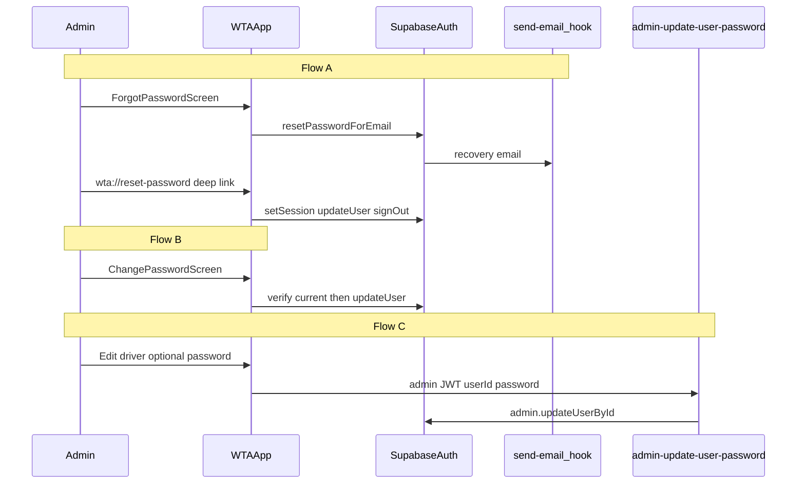

# WTA Admin Password Reset & Change Password

Implementation guide for **WaterTankerAppv1** (WTA admin + driver app). Self-service password flows are **admin-only**. Drivers have no forgot-password or change-password UI; admins reset driver credentials from Driver Management.

Shared Supabase project with the customer app. Email delivery uses the **Send Email** Auth hook + `send-email` Edge Function (see [`RESEND_AUTH_EMAIL_SETUP.md`](./RESEND_AUTH_EMAIL_SETUP.md)).

Reference: [`PASSWORD_RESET_AND_CHANGE_PASSWORD.md`](./PASSWORD_RESET_AND_CHANGE_PASSWORD.md) (customer app patterns).

---

## Flows

| Flow | Who | Where | Mechanism |
|------|-----|-------|-----------|
| **A — Forgot password** | Admin (logged out) | Login → Forgot password → email → Reset password | `resetPasswordForEmail` + deep link `wta://reset-password` |
| **B — Change own password** | Admin (logged in) | Profile → Change Password | `signInWithPassword` + `updateUser` |
| **C — Change driver password** | Admin | Driver Management → Edit driver | `admin-update-user-password` Edge Function |

### Driver exclusions

- No **Forgot password?** on driver login path
- No recovery UI for non-admin accounts (blocked after deep link)
- No change-password screen in driver stack
- Forgotten driver password → admin resets via Flow C

---

## Architecture



---

## Prerequisites

1. Resend domain verified; `send-email` deployed; Auth Send Email hook enabled
2. Supabase **Redirect URLs** includes `wta://reset-password`
3. Deploy `admin-update-user-password` Edge Function
4. App env: `EXPO_PUBLIC_PASSWORD_RESET_REDIRECT_URL=wta://reset-password`
5. Expo `scheme: wta` — rebuild dev client after scheme change

---

## Environment

```env
EXPO_PUBLIC_PASSWORD_RESET_REDIRECT_URL=wta://reset-password
```

---

## Security rules

1. No Resend API calls from the app — Supabase Auth only
2. Generic success after forgot-password submit (no email enumeration)
3. Client rate limit: `password_reset` — 3 requests/hour per email
4. After forgot-password reset: sign out; user logs in with new password
5. Change own password: verify current password first
6. Never store passwords in `public.users` / profile payloads
7. Never display passwords in `DriverModal`
8. Recovery deep link: only users with **admin** role may proceed to reset screen

---

## File map

| Action | File |
|--------|------|
| Create | `src/utils/authDeepLink.ts` |
| Create | `src/screens/auth/ForgotPasswordScreen.tsx` |
| Create | `src/screens/auth/ResetPasswordScreen.tsx` |
| Create | `src/screens/admin/ChangePasswordScreen.tsx` |
| Create | `supabase/functions/admin-update-user-password/index.ts` |
| Modify | `src/services/auth.service.ts` |
| Modify | `src/store/authStore.ts` |
| Modify | `src/navigation/AuthNavigator.tsx` |
| Modify | `src/navigation/AdminNavigator.tsx` |
| Modify | `src/screens/auth/LoginScreen.tsx` |
| Modify | `src/screens/admin/AdminProfileScreen.tsx` |
| Modify | `src/screens/admin/DriverManagementScreen.tsx` |
| Modify | `src/components/admin/EditProfileForm.tsx` |
| Modify | `src/components/admin/DriverModal.tsx` |
| Modify | `App.tsx`, `app.config.js`, `.env.example`, `src/constants/config.ts`, `src/types/index.ts` |

---

## Manual verification

1. Admin forgot password → email → deep link → reset → login with new password
2. Admin change password → wrong current fails → success keeps session
3. Admin edit driver with new password → driver logs in with new password
4. Admin edit driver without password → profile updates, login password unchanged
5. Driver login → no forgot-password link
6. Driver recovery link → blocked (not admin)
7. Fourth reset request within 1 hour → rate limit message
8. DriverModal does not show password field

---

## Related docs

- [`RESEND_AUTH_EMAIL_SETUP.md`](./RESEND_AUTH_EMAIL_SETUP.md)
- [`PASSWORD_RESET_AND_CHANGE_PASSWORD.md`](./PASSWORD_RESET_AND_CHANGE_PASSWORD.md)
