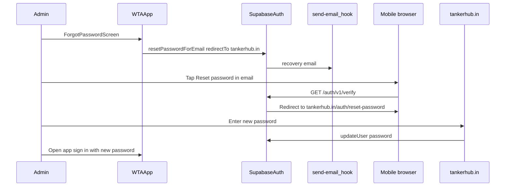
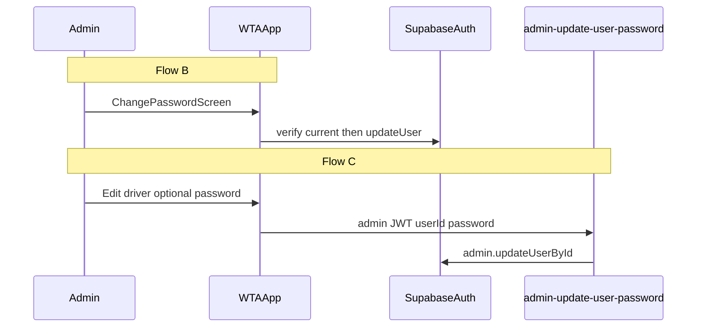

# WTA Admin Password Reset & Change Password

Implementation guide for **WaterTankerAppv1** (WTA admin + driver app). Self-service password flows are **admin-only**. Drivers have no forgot-password or change-password UI; admins reset driver credentials from Driver Management.

Shared Supabase project with the customer app. Email delivery uses the **Send Email** Auth hook + `send-email` Edge Function (see [`RESEND_AUTH_EMAIL_SETUP.md`](./RESEND_AUTH_EMAIL_SETUP.md)).

Reference: [`PASSWORD_RESET_ROUTING.md`](./PASSWORD_RESET_ROUTING.md) (routing flow), [`PASSWORD_RESET_AND_CHANGE_PASSWORD.md`](./PASSWORD_RESET_AND_CHANGE_PASSWORD.md) (implementation patterns).

---

## Flows

| Flow | Who | Where | Mechanism |
|------|-----|-------|-----------|
| **A — Forgot password** | Admin (logged out) | Login → Forgot password → email → web reset → sign in | `resetPasswordForEmail` + `https://tankerhub.in/auth/reset-password` |
| **B — Change own password** | Admin (logged in) | Profile → Change Password | `signInWithPassword` + `updateUser` |
| **C — Change driver password** | Admin | Driver Management → Edit driver | `admin-update-user-password` Edge Function |

### Driver exclusions

- No **Forgot password?** on driver login path
- No recovery UI for non-admin accounts (blocked after in-app deep link only)
- No change-password screen in driver stack
- Forgotten driver password → admin resets via Flow C

---

## Architecture

### Flow A — Production (web)



### Flow A — Dev alternative (in-app deep link)

When `EXPO_PUBLIC_PASSWORD_RESET_REDIRECT_URL=wta://reset-password`:

```
Email link → wta://reset-password#tokens → ResetPasswordScreen → updateUser → signOut → Login
```

Only users with **admin** role may proceed (`authStore` role gate). Non-admin accounts are signed out.

### Flow B & C



---

## Prerequisites

1. Resend domain verified; `send-email` deployed; Auth Send Email hook enabled
2. Supabase **Redirect URLs** includes `https://tankerhub.in/auth/reset-password` (production)
3. Deploy `admin-update-user-password` Edge Function
4. App env (production): `EXPO_PUBLIC_PASSWORD_RESET_REDIRECT_URL=https://tankerhub.in/auth/reset-password`
5. EAS secrets: same env var for preview/production builds
6. Optional dev: add `wta://reset-password` to Redirect URLs and set env to deep link; Expo `scheme: wta`

---

## Environment

**Production (web flow):**

```env
EXPO_PUBLIC_PASSWORD_RESET_REDIRECT_URL=https://tankerhub.in/auth/reset-password
```

**Local/dev (in-app deep link):**

```env
EXPO_PUBLIC_PASSWORD_RESET_REDIRECT_URL=wta://reset-password
```

---

## Security rules

1. No Resend API calls from the app — Supabase Auth only
2. Generic success after forgot-password submit (no email enumeration)
3. Client rate limit: `password_reset` — 3 requests/hour per email
4. After forgot-password reset (web or deep link): user signs in with new password
5. Change own password: verify current password first
6. Never store passwords in `public.users` / profile payloads
7. Never display passwords in `DriverModal`
8. In-app deep link only: recovery session gated to **admin** role

---

## File map

| Action | File |
|--------|------|
| Create | `src/utils/authDeepLink.ts` |
| Create | `src/screens/auth/ForgotPasswordScreen.tsx` |
| Create | `src/screens/auth/ResetPasswordScreen.tsx` (dev deep-link path only) |
| Create | `src/screens/admin/ChangePasswordScreen.tsx` |
| Create | `supabase/functions/admin-update-user-password/index.ts` |
| Modify | `src/services/auth.service.ts` |
| Modify | `src/store/authStore.ts` |
| Modify | `src/navigation/AuthNavigator.tsx` |
| Modify | `src/navigation/AdminNavigator.tsx` |
| Modify | `src/screens/auth/LoginScreen.tsx` |
| Modify | `src/screens/admin/AdminProfileScreen.tsx` |
| Modify | `src/screens/admin/DriverManagementScreen.tsx` |
| Modify | `src/components/admin/EditProfileForm.tsx` |
| Modify | `src/components/admin/DriverModal.tsx` |
| Modify | `App.tsx`, `app.config.js`, `.env.example`, `src/constants/config.ts`, `src/types/index.ts` |

---

## Manual verification

1. Admin forgot password → email link contains `redirect_to=https://tankerhub.in/auth/reset-password` (not `www.tankerhub.in`) → browser reset → login with new password
2. Admin change password → wrong current fails → success keeps session
3. Admin edit driver with new password → driver logs in with new password
4. Admin edit driver without password → profile updates, login password unchanged
5. Driver login → no forgot-password link
6. Driver recovery deep link (dev only) → blocked (not admin)
7. Fourth reset request within 1 hour → rate limit message
8. DriverModal does not show password field

---

## Troubleshooting — email shows `redirect_to=https://www.tankerhub.in`

If the reset email’s verify link has `redirect_to=https://www.tankerhub.in` (homepage, no `/auth/reset-password`), the **installed admin build** did not pass the web reset URL to Supabase. Supabase substituted your project **Site URL** instead (often `https://www.tankerhub.in`).

**Fix:**

1. Ensure `EXPO_PUBLIC_PASSWORD_RESET_REDIRECT_URL=https://tankerhub.in/auth/reset-password` is in `eas.json` (all build profiles) and local `.env`.
2. Rebuild and reinstall the admin app (env vars are baked in at build time).
3. In Supabase Dashboard → **Authentication → URL Configuration**:
   - Add `https://tankerhub.in/auth/reset-password` to **Redirect URLs**
   - Align **Site URL** with your canonical domain (prefer `https://tankerhub.in` without `www`, or add both www and non-www reset paths to Redirect URLs)

Compare with customer email: correct link includes `redirect_to=https%3A%2F%2Ftankerhub.in%2Fauth%2Freset-password`.

---

## Related docs

- [`PASSWORD_RESET_ROUTING.md`](./PASSWORD_RESET_ROUTING.md)
- [`RESEND_AUTH_EMAIL_SETUP.md`](./RESEND_AUTH_EMAIL_SETUP.md)
- [`PASSWORD_RESET_AND_CHANGE_PASSWORD.md`](./PASSWORD_RESET_AND_CHANGE_PASSWORD.md)
